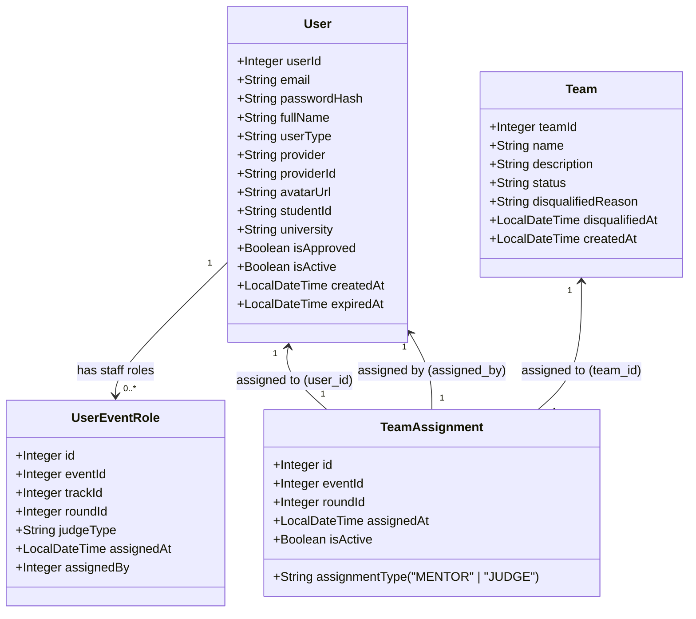

# 📋 Báo Cáo Đánh Giá & Hướng Dẫn: TeamAssignment

> [!NOTE]
> Tài liệu này được biên soạn để hỗ trợ bạn kiểm thử, đánh giá cấu trúc cơ sở dữ liệu và API cho tính năng gán Mentor và Judge cho các đội thi trong SEAL Hackathon.

---

## 🗺️ 1. Sơ đồ Ràng buộc Quan hệ & Workflow

Dưới đây là sơ đồ Mermaid chi tiết thể hiện mối liên kết và **đầy đủ các thuộc tính** của tài khoản người dùng (`User`), vai trò trong sự kiện (`UserEventRole`), bảng phân công (`TeamAssignment`) và các đội thi (`Team`):



---

## 🗄️ 2. Thiết Kế Cơ Sở Dữ Liệu MySQL

> [!IMPORTANT]
> Bảng `TeamAssignment` liên kết trực tiếp với thực thể `User(user_id)` thay vì liên kết vòng qua `UserEventRole(id)` để tránh truy vấn phức tạp và tối ưu hiệu năng.

### Bảng cấu trúc cột:

| Tên Cột | Kiểu Dữ Liệu | Ràng Buộc | Mô tả |
| :--- | :--- | :--- | :--- |
| `id` | `INT` | `AUTO_INCREMENT, PRIMARY KEY` | Khóa chính của bảng |
| `team_id` | `INT` | `NOT NULL, FK -> Team(team_id)` | Đội thi được phân công |
| `user_id` | `INT` | `NOT NULL, FK -> User(user_id)` | Mentor hoặc Judge được phân công |
| `assignment_type` | `VARCHAR(20)` | `NOT NULL` | Nhận giá trị `'MENTOR'` hoặc `'JUDGE'` |
| `event_id` | `INT` | `NULL` | ID sự kiện Hackathon |
| `round_id` | `INT` | `NULL` | ID vòng đấu (chỉ áp dụng cho Judge) |
| `assigned_at` | `DATETIME` | `NOT NULL, DEFAULT CURRENT_TIMESTAMP` | Thời điểm phân công |
| `assigned_by` | `INT` | `NULL, FK -> User(user_id)` | ID Coordinator thực hiện phân công |
| `is_active` | `TINYINT(1)` | `NOT NULL, DEFAULT 1` | Trạng thái hoạt động (1: Active, 0: Inactive) |

### Chỉ Mục Tối Ưu Tốc Độ Truy Vấn (Indexes):
*   `idx_assignment_user_type` (`user_id`, `assignment_type`): Tăng tốc độ truy vấn danh sách phân công của một Mentor hoặc Judge cụ thể.
*   `idx_assignment_team_status` (`team_id`, `is_active`): Tối ưu hóa việc lọc các phân công đang có hiệu lực của một đội thi.

---

## 💻 3. Các Lớp Mã Nguồn Spring Boot Đã Viết

### 3.1. Entity Lớp Ánh Xạ
📄 [TeamAssignment.java](file:///d:/FPT%20Uni/k%C3%AC%205/test/seal-hackathon-system/back-end/src/seal-api/src/main/java/com/seal/hackathon/entity/TeamAssignment.java)

> [!TIP]
> Sử dụng các mối quan hệ `@ManyToOne(fetch = FetchType.LAZY)` để tránh tự động tải toàn bộ dữ liệu thừa lên bộ nhớ ngay khi truy vấn (cơ chế Lazy Loading).

### 3.2. Repository Tối Ưu Hóa Query & Giải quyết lỗi N+1 Queries
📄 [TeamAssignmentRepository.java](file:///d:/FPT%20Uni/k%C3%AC%205/test/seal-hackathon-system/back-end/src/seal-api/src/main/java/com/seal/hackathon/repository/TeamAssignmentRepository.java)

**Lỗi N+1 Queries là gì?**
Giả sử một Mentor được phân công 10 đội thi. Khi bạn truy vấn danh sách 10 phân công này, Hibernate sẽ chạy **1** câu query `SELECT` ban đầu. Tuy nhiên, vì bảng `TeamAssignment` liên kết với `Team`, `Event`, và `Track`, khi code vòng lặp duyệt qua 10 phân công này để lấy thông tin chi tiết (ví dụ: `assignment.getTeam().getName()`), Hibernate sẽ ngầm tự động sinh thêm **10** câu lệnh `SELECT` để lấy thông tin Team, **10** câu lấy Event, v.v. Kết quả là thay vì 1 câu query, cơ sở dữ liệu phải chịu đựng 1 + 10 + 10... (N+1) câu query, làm chậm hệ thống nghiêm trọng.

**Giải pháp với `JOIN FETCH`:**
Chúng tôi sử dụng câu truy vấn JPQL tùy chỉnh kết hợp với từ khóa **`JOIN FETCH`**:
```java
@Query("SELECT ta FROM TeamAssignment ta " +
       "JOIN FETCH ta.team t " +
       "JOIN FETCH t.event e " +
       "JOIN FETCH t.track tr " +
       "WHERE ta.user.userId = :userId " +
       "AND ta.assignmentType = :assignmentType " +
       "AND ta.isActive = true " +
       "ORDER BY ta.assignedAt DESC")
```
*   **Mục đích:** Từ khóa `JOIN FETCH` ép Hibernate gom toàn bộ các bảng liên quan (Team, Event, Track) và nối (JOIN) chúng lại ngay trong **1 lần truy vấn SQL duy nhất**. Khi dữ liệu trả về, tất cả chi tiết đã nằm sẵn trong bộ nhớ, loại bỏ hoàn toàn các truy vấn lắt nhắt N+1.

### 3.3. Cấu trúc Response DTO (Data Transfer Object)
DTO là các lớp đối tượng được thiết kế riêng biệt chỉ để hứng dữ liệu và trả về cho phía Frontend (Client), thay vì trả về toàn bộ dữ liệu thô từ Entity (vốn có thể chứa thông tin nhạy cảm như mật khẩu hay cấu trúc DB nội bộ).

*   📄 **[MentorAssignmentResponse.java](file:///d:/FPT%20Uni/k%C3%AC%205/test/seal-hackathon-system/back-end/src/seal-api/src/main/java/com/seal/hackathon/dto/response/MentorAssignmentResponse.java)**: 
    *   Được thiết kế để chỉ bao gồm các trường cần thiết cho giao diện Mentor: `mentorId`, `mentorName`, `eventName` và danh sách các `teams`.
    *   **Theo yêu cầu của bạn:** Cột `status` của team đã được loại bỏ hoàn toàn khỏi JSON trả về vì không cần thiết.
*   📄 **[JudgeAssignmentResponse.java](file:///d:/FPT%20Uni/k%C3%AC%205/test/seal-hackathon-system/back-end/src/seal-api/src/main/java/com/seal/hackathon/dto/response/JudgeAssignmentResponse.java)**:
    *   Cấu trúc tương tự Mentor, nhưng **bổ sung thêm trường `roundId`** vào bên trong thông tin từng đội. Điều này rất quan trọng vì Judge cần biết chính xác họ đang phải chấm điểm đội đó ở vòng đấu nào (ví dụ: vòng Sơ loại hay vòng Chung kết).
*   Cả hai DTO đều tận dụng cấu trúc "lớp tĩnh lồng nhau" (Nested Static Classes) như `AssignedTeamInfo` và `TeamMemberInfo` để nhóm dữ liệu một cách trực quan, giúp Frontend dễ dàng bóc tách JSON.

### 3.4. Nghiệp Vụ Xử Lý Dữ Liệu (Service Layer)
📄 [TeamAssignmentService.java](file:///d:/FPT%20Uni/k%C3%AC%205/test/seal-hackathon-system/back-end/src/seal-api/src/main/java/com/seal/hackathon/service/TeamAssignmentService.java)
Đây là "bộ não" xử lý quy trình logic của hệ thống. Khi một yêu cầu lấy danh sách phân công được gửi tới, Service sẽ làm các bước sau:
1.  **Xác thực người dùng:** Kiểm tra `userId` có thực sự tồn tại trong database không (`userRepository.findById`).
2.  **Lọc dữ liệu chính xác:** Gọi hàm truy vấn đã tối ưu (đề cập ở phần 3.2) để chỉ lấy các bản ghi có đúng vai trò (`MENTOR` hoặc `JUDGE`) và đặc biệt là chỉ lấy các bản ghi có **`isActive = true`**.
3.  **Gom nhóm dữ liệu:** Chạy vòng lặp qua các đội thi đã lấy được. Với mỗi đội, Service tiếp tục truy vấn bảng `TeamMember` (`teamMemberRepository.findByTeam_TeamId`) để rút trích danh sách thành viên cụ thể của đội đó.
4.  **Lắp ráp Response:** Đóng gói tất cả thông tin lại vào DTO tương ứng và trả về kết quả cuối cùng.

### 3.5. Điểm Cuối Endpoints Phân Quyền Bảo Mật (Controller Layer)
📄 [TeamAssignmentController.java](file:///d:/FPT%20Uni/k%C3%AC%205/test/seal-hackathon-system/back-end/src/seal-api/src/main/java/com/seal/hackathon/controller/TeamAssignmentController.java)
Controller đóng vai trò là "người gác cổng" tiếp nhận các request từ Frontend. Nó xử lý 2 vấn đề trọng tâm:

1.  **Định tuyến URL (Endpoints):**
    *   API cho Mentor: Định tuyến bằng `@GetMapping("/mentor/assignments")`
    *   API cho Judge: Định tuyến bằng `@GetMapping("/judge/assignments")`
2.  **Bảo vệ chặt chẽ (Security & PreAuthorize):**
    *   Mỗi API đều được bảo vệ bởi annotation `@PreAuthorize`. Ví dụ, `@PreAuthorize("hasRole('MENTOR')")` đảm bảo rằng chỉ có những user đã đăng nhập hợp lệ và được cấp quyền MENTOR mới có thể gọi API này. Bất kỳ ai khác (kể cả thí sinh hay user bình thường) gọi vào đều bị hệ thống chặn đứng và trả lỗi `403 Forbidden`.
    *   **Bảo mật dữ liệu cá nhân:** Controller không nhận `userId` từ đường dẫn (URL) hay Payload do người dùng gửi lên. Thay vào đó, nó tự động trích xuất `userId` từ token bảo mật JWT (thông qua `Authentication authentication -> principal.getUserId()`). Điều này ngăn chặn hoàn toàn việc một người dùng cố ý nhập ID của người khác để xem trộm danh sách phân công.

---

## 🗃️ 4. Dữ Liệu Giả Lập Để Kiểm Thử (Mock Data)

Tập tin SQL giả lập dữ liệu: 📄 [seal_mock_data.sql](file:///d:/FPT%20Uni/k%C3%AC%205/test/seal-hackathon-system/back-end/database%20scripts/seal_mock_data.sql)

```sql
-- Thêm phân công giả lập:
-- Mentor An (user_id = 2) được gán Team Alpha (Active) và Team Beta (Active). Team Gamma (Inactive) sẽ bị lọc bỏ.
-- Judge Binh (user_id = 3) được gán chấm Team Alpha (Active) và Team Beta (Active). Team Delta (Inactive) sẽ bị lọc bỏ.
```

---

## 🧪 5. Kết Quả Gọi API Mẫu (API Contract)

### 🟢 API 1: `GET /api/mentor/assignments`
*   **Role yêu cầu:** `ROLE_MENTOR`
*   **Dữ liệu phản hồi (JSON):**
```json
{
  "success": true,
  "message": "Mentor assignments retrieved successfully.",
  "data": {
    "mentorId": 2,
    "mentorName": "Tran Van An",
    "eventName": "SEAL Spring 2026",
    "teams": [
      {
        "teamId": 1,
        "teamName": "Team Alpha",
        "trackName": "Web Application",
        "assignedAt": "2026-06-04T10:45:00",
        "members": [
          { "userId": 5, "fullName": "Hoang Van Leader", "email": "leader1@fpt.edu.vn", "memberRole": "LEADER" },
          { "userId": 6, "fullName": "Nguyen Thi Lan", "email": "member1@fpt.edu.vn", "memberRole": "MEMBER" }
        ]
      }
    ]
  }
}
```

### 🟢 API 2: `GET /api/judge/assignments`
*   **Role yêu cầu:** `ROLE_JUDGE`
*   **Dữ liệu phản hồi (JSON):**
```json
{
  "success": true,
  "message": "Judge assignments retrieved successfully.",
  "data": {
    "judgeId": 3,
    "judgeName": "Le Van Binh",
    "eventName": "SEAL Spring 2026",
    "teams": [
      {
        "teamId": 1,
        "teamName": "Team Alpha",
        "trackName": "Web Application",
        "roundId": 1,
        "assignedAt": "2026-06-04T10:45:00",
        "members": [
          { "userId": 5, "fullName": "Hoang Van Leader", "email": "leader1@fpt.edu.vn", "memberRole": "LEADER" }
        ]
      }
    ]
  }
}
```
