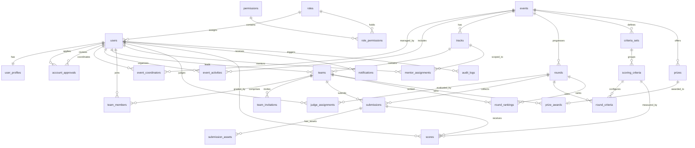

# SEAL Hackathon Management System — Database Redesign (SQL Server)

Complete production-level database redesign for **SQL Server 2016+ / SSMS 19**.

---

## Deliverables

| File | Purpose |
|:-----|:--------|
| [01_seal_hackathon_ddl.sql](file:///d:/FPT%20Uni/kì%205/SWP391/seal-hackathon-system/docs/database/SQL%20server/01_seal_hackathon_ddl.sql) | **CREATE TABLE**, FK constraints, CHECK constraints, indexes, triggers |
| [02_seal_hackathon_seed_data.sql](file:///d:/FPT%20Uni/kì%205/SWP391/seal-hackathon-system/docs/database/SQL%20server/02_seal_hackathon_seed_data.sql) | Realistic sample data (17 users, 2 events, 3 tracks, 4 teams, 3 rounds, 36 scores) |

> [!IMPORTANT]
> **Execution order:** Run `01_seal_hackathon_ddl.sql` first, then `02_seal_hackathon_seed_data.sql`.

---

## 1. ERD Analysis — Critical Issues Identified

### Issue 1: `EventCoordinator` Table — 3NF Violation (Severity: HIGH)

**Original ERD:** `EventCoordinator` had `event_id` as PK with mixed attributes: `event_title`, `event_type` (event data) alongside `full_name`, `student_id` (user data).

**Problems:**
- Violates Third Normal Form (transitive dependency on non-key attributes).
- Limits each event to a single coordinator.
- Duplicates user profile data already stored elsewhere.

**Redesign:**
- **`event_coordinators`** — Clean M:N junction table `(event_id, user_id)`. An event can have multiple coordinators.
- **`event_activities`** — Captures workshops/webinars/mentoring/announcements that were incorrectly embedded in the coordinator entity.

---

### Issue 2: User Profile Data Duplication (Severity: HIGH)

**Original ERD:** `full_name`, `student_id`, `University_name`, `student_type` appeared in both `TeamMember` and `EventCoordinator`.

**Problem:** If a user is both a coordinator and participant, their name/student data exists in multiple places — update anomalies guaranteed.

**Redesign:** Created centralized `user_profiles` table (1:1 with `users`). All role-specific tables reference `user_id` only.

---

### Issue 3: Redundant Team Leader Logic (Severity: MEDIUM)

**Original ERD:** `Team.leader_id` pointed to `User`, while `TeamMember.is_leader` was a boolean — duplicated state.

**Redesign:** `teams.leader_id` is the single source of truth. `team_members.role_in_team` uses `NVARCHAR(20)` with `'LEADER'`/`'MEMBER'` values (more extensible than boolean).

---

### Issue 4: Inflexible Submission Structure (Severity: MEDIUM)

**Original ERD:** Fixed columns: `repo_url`, `demo_url`, `slide_url`. Adding a Figma link or video demo requires DDL changes.

**Redesign:** Created `submission_assets` table (1:N from submissions). Teams submit any number of typed assets: `'GITHUB_REPO'`, `'SLIDE_DECK'`, `'DEMO_VIDEO'`, `'FIGMA_DESIGN'`, etc.

---

### Issue 5: Global-Only Role System (Severity: MEDIUM)

**Original ERD:** User had a single `role_id`. A user could not be a participant in Event A and a judge in Event B.

**Redesign:** `users.role_id` handles system-level roles (`ADMIN`, `ORGANIZER`, `USER`). Event-specific roles are handled via: `event_coordinators`, `mentor_assignments`, `judge_assignments`.

---

### Issue 6: Missing Audit & Soft Delete (Severity: LOW)

**Original ERD:** Most tables lacked `created_at`, `updated_at`, and `deleted_at`.

**Redesign:** All transactional tables include `created_at`, `updated_at` (with auto-update triggers), and `deleted_at` (soft delete).

---

## 2. Complete Schema — 27 Tables



---

## 3. Table-by-Table Design Summary

### 3.1 Security & Authentication (5 tables)

| Table | PK | Key Columns | Purpose |
|:------|:---|:------------|:--------|
| `roles` | `role_id` | `role_name` (UNIQUE) | System roles: ADMIN, ORGANIZER, USER |
| `permissions` | `permission_id` | `permission_key` (UNIQUE) | Granular RBAC keys (e.g., `event:create`) |
| `role_permissions` | `(role_id, permission_id)` | — | M:N junction for RBAC |
| `users` | `user_id` | `email` (UNIQUE), `status` | Credentials + account status |
| `user_profiles` | `user_id` | `first_name`, `student_id`, `university_name` | Personal info (1:1 with users) |
| `account_approvals` | `approval_id` | `user_id`, `reviewed_by`, `status` | Registration approval workflow |

### 3.2 Event Management (4 tables)

| Table | PK | Key Columns | Purpose |
|:------|:---|:------------|:--------|
| `events` | `event_id` | `event_name`, `season`, `academic_year`, `status` | Hackathon events |
| `event_coordinators` | `(event_id, user_id)` | `assigned_at` | M:N: users as coordinators |
| `event_activities` | `activity_id` | `event_id`, `organizer_id`, `activity_type` | Workshops, webinars, announcements |
| `tracks` | `track_id` | `event_id`, `track_name`, `max_teams` | Track divisions (AI, FinTech, etc.) |

### 3.3 Team Management (4 tables)

| Table | PK | Key Columns | Purpose |
|:------|:---|:------------|:--------|
| `teams` | `team_id` | `track_id`, `leader_id`, `team_name`, `status` | Participant teams |
| `team_members` | `(team_id, user_id)` | `role_in_team` | M:N: users in teams |
| `team_invitations` | `invitation_id` | `invitee_email`, `status`, `expires_at` | Invitation workflow |
| `mentor_assignments` | `assignment_id` | `mentor_id`, `track_id`/`team_id` | Flexible mentor assignment |

### 3.4 Rounds & Submissions (4 tables)

| Table | PK | Key Columns | Purpose |
|:------|:---|:------------|:--------|
| `rounds` | `round_id` | `event_id`, `round_order`, `submission_deadline` | Evaluation rounds |
| `judge_assignments` | `assignment_id` | `judge_id`, `round_id`, `judge_type` | Judge-to-round mapping |
| `submissions` | `submission_id` | `team_id`, `round_id` (UNIQUE pair), `project_name` | Team submissions |
| `submission_assets` | `asset_id` | `submission_id`, `asset_type`, `asset_url` | Flexible asset storage |

### 3.5 Scoring & Rankings (4 tables)

| Table | PK | Key Columns | Purpose |
|:------|:---|:------------|:--------|
| `criteria_sets` | `set_id` | `event_id`, `set_name` | Reusable criteria groups |
| `scoring_criteria` | `criteria_id` | `set_id`, `max_score`, `default_weight` | Individual rubric items |
| `round_criteria` | `(round_id, criteria_id)` | `weight_override` | Criteria-to-round mapping |
| `scores` | `score_id` | `submission_id`, `judge_id`, `criteria_id` (UNIQUE triple) | Individual scores |
| `round_rankings` | `ranking_id` | `team_id`, `round_id` (UNIQUE pair), `position` | Pre-calculated rankings |

### 3.6 Rewards, Notifications & Audit (4 tables)

| Table | PK | Key Columns | Purpose |
|:------|:---|:------------|:--------|
| `prizes` | `prize_id` | `event_id`, `prize_name`, `rank_position` | Prize definitions |
| `prize_awards` | `award_id` | `team_id`, `prize_id` (UNIQUE) | Prize-to-team mapping |
| `notifications` | `notification_id` | `user_id`, `is_read` | In-app alerts |
| `audit_logs` | `log_id` | `performed_by`, `entity_type`, `entity_id` | Activity log (JSONB details) |

---

## 4. SQL Server Specific Adaptations

| Concern | Solution |
|:--------|:---------|
| **Unicode (Vietnamese)** | All string columns use `NVARCHAR` (not `VARCHAR`) with `N'...'` string literals |
| **Boolean** | SQL Server has no `BOOLEAN` → uses `BIT` (`0`/`1`) |
| **Timestamps** | `DATETIME2` with `SYSUTCDATETIME()` for UTC precision |
| **Auto-increment** | `INT IDENTITY(1,1)` / `BIGINT IDENTITY(1,1)` |
| **JSON validation** | `NVARCHAR(MAX)` + `CHECK (ISJSON(details) = 1)` on `audit_logs.details` |
| **Cascade cycles (Error 1785)** | SQL Server prohibits multiple cascade paths. Strategic `ON DELETE NO ACTION` on secondary FK paths (e.g., `event_coordinators.user_id`, `teams.track_id`, `scores.judge_id`). Application must handle orphan cleanup. |
| **Auto `updated_at`** | `AFTER UPDATE` triggers on 8 tables (SQL Server lacks `BEFORE UPDATE`) |
| **Filtered indexes** | Partial indexes: `WHERE deleted_at IS NULL`, `WHERE is_read = 0` |

---

## 5. Indexing Strategy

| Category | Index Count | Strategy |
|:---------|:------------|:---------|
| **Foreign Key Indexes** | 28 | Explicit B-Tree on all FK columns (SQL Server does NOT auto-index FKs) |
| **Unique Composite** | 6 | Serve as both constraints and fast-lookup indexes |
| **Filtered/Partial** | 5 | Optimize queries on active records (`WHERE deleted_at IS NULL`) and unread notifications |
| **Covering Indexes** | 2 | `user_profiles(last_name, first_name)`, `audit_logs(created_at DESC)` |

---

## 6. Seed Data Summary

| Entity | Count | Notes |
|:-------|:------|:------|
| Roles | 3 | ADMIN, ORGANIZER, USER |
| Permissions | 12 | Granular RBAC keys |
| Users | 17 | 1 admin, 2 coordinators, 3 judges, 2 mentors, 8 participants, 1 pending |
| Events | 2 | Summer 2026 (OPEN), Fall 2026 (DRAFT) |
| Tracks | 3 | GenAI, FinTech, HealthTech |
| Teams | 4 | 3 approved, 1 pending |
| Rounds | 3 | Idea → Prototype → Final |
| Submissions | 3 | Round 1 submissions with 8 total assets |
| Scores | 36 | 3 judges × 3 teams × 4 criteria |
| Rankings | 3 | Pre-calculated Round 1 results |
| Prizes | 5 | Including cash values in VND |
| Notifications | 7 | Mixed read/unread states |
| Audit Logs | 9 | JSON-structured change details |

---

## Verification Plan

### Automated Tests
```sql
-- After executing both scripts in SSMS 19, run:

-- 1. Verify all tables exist (expect 27 rows)
SELECT COUNT(*) AS table_count FROM INFORMATION_SCHEMA.TABLES WHERE TABLE_TYPE = 'BASE TABLE';

-- 2. Verify all foreign keys (expect 35+ constraints)
SELECT COUNT(*) AS fk_count FROM INFORMATION_SCHEMA.REFERENTIAL_CONSTRAINTS;

-- 3. Verify all indexes
SELECT COUNT(*) AS index_count FROM sys.indexes WHERE is_primary_key = 0 AND is_unique_constraint = 0 AND type > 0;

-- 4. Test a cross-table query (team rankings with member info)
SELECT t.team_name, rr.position, rr.total_score,
       up.first_name + N' ' + up.last_name AS leader_name
FROM round_rankings rr
JOIN teams t ON rr.team_id = t.team_id
JOIN users u ON t.leader_id = u.user_id
JOIN user_profiles up ON u.user_id = up.user_id
WHERE rr.round_id = 1
ORDER BY rr.position;
```

### Manual Verification
- Open both `.sql` files in **SSMS 19** and execute sequentially
- Verify no errors in the Messages tab
- Expand **Tables** node in Object Explorer to confirm all 27 tables
- Right-click any table → **Design** to inspect columns, types, and constraints
