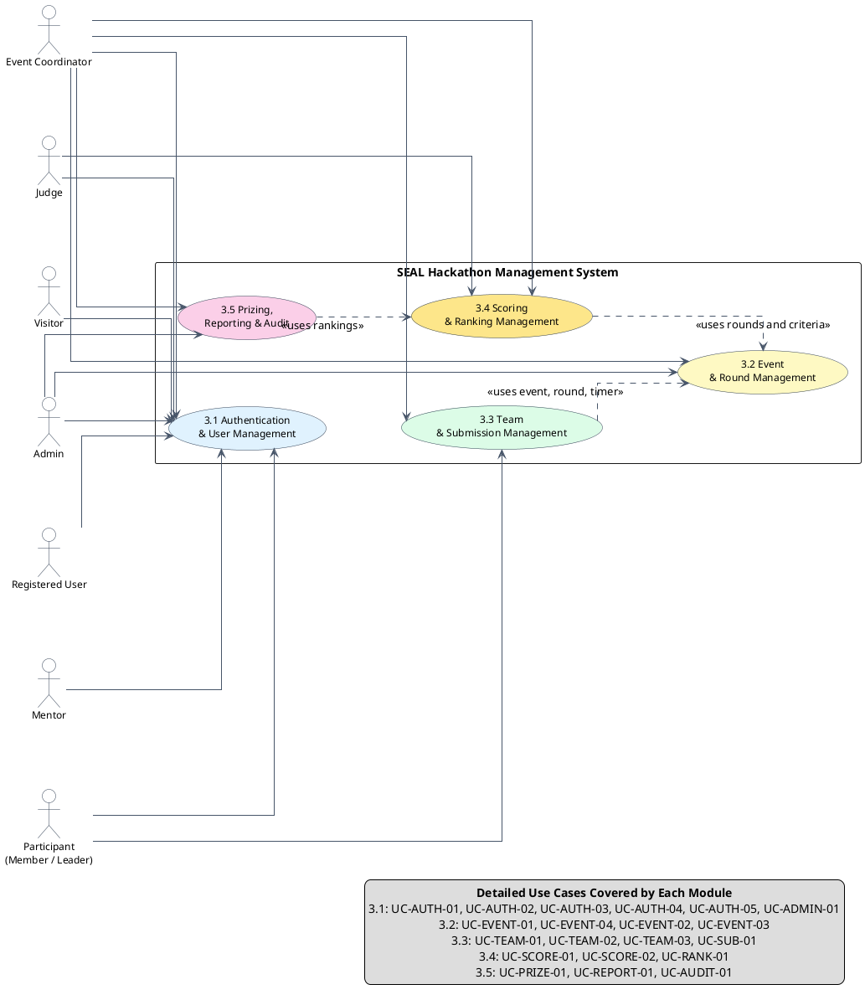
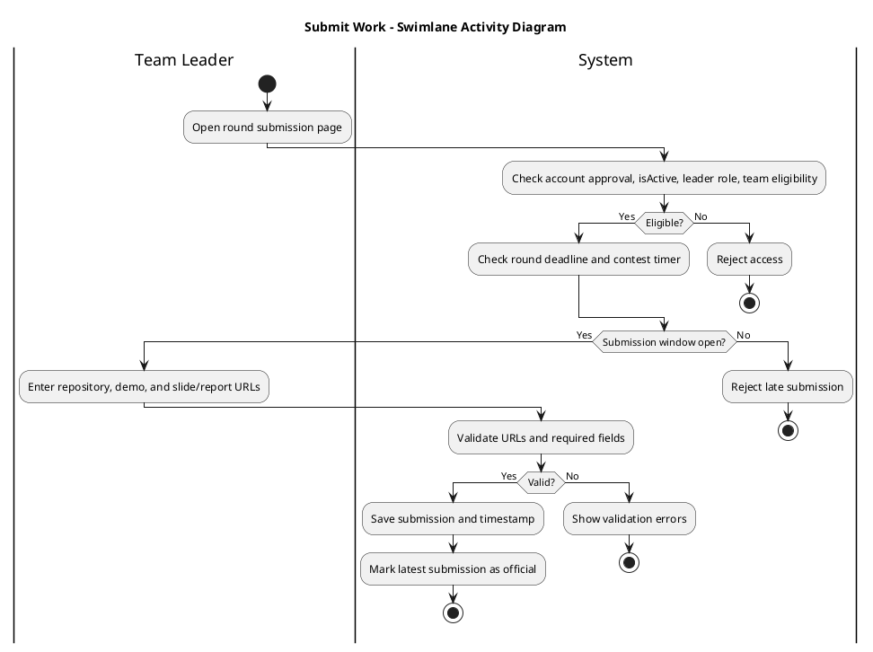
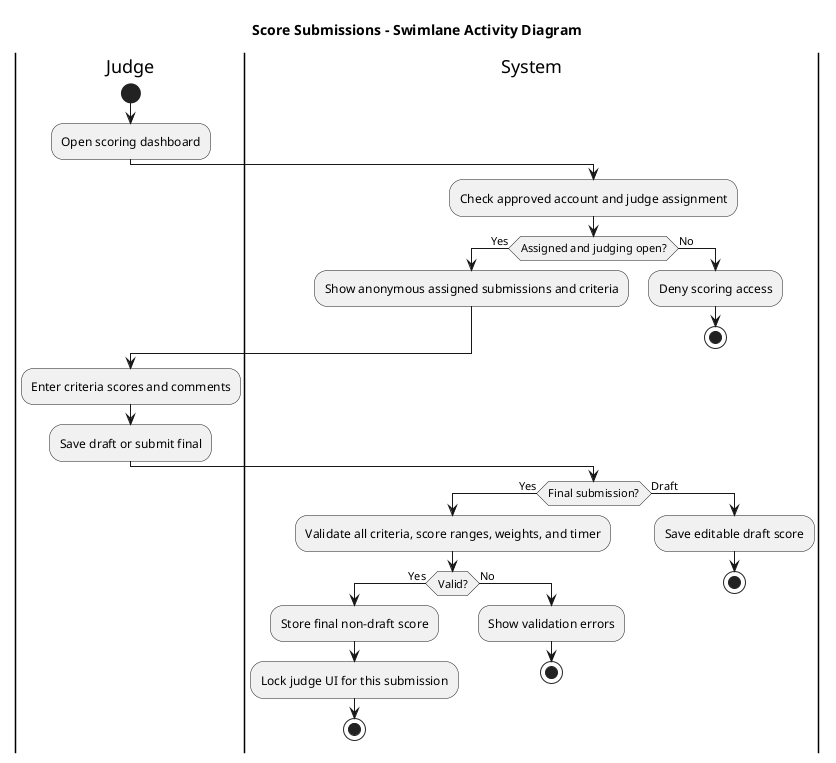

# 3. System Features, Use Cases, and Business Rules

This section describes the main SEAL system features using compact Use Case Specifications and mapped Business Rules. To keep the SRS readable, each use case is summarized in a two-column table while preserving actor, flow, exception, postcondition, functional requirement, and business rule traceability.

## 3.0 List of System Features by Module

| Module | Feature ID | System Feature | Primary Actor(s) | Priority |
|---|---:|---|---|---|
| 3.1 Authentication and User Management | UC-AUTH-01 | Register Account | FPT Student, External Student, Staff User | High |
| 3.1 Authentication and User Management | UC-AUTH-02 | Login and Access Approved Account | All registered users | High |
| 3.1 Authentication and User Management | UC-AUTH-03 | Review and Approve Accounts | Event Coordinator | High |
| 3.1 Authentication and User Management | UC-AUTH-04 | Manage Participation Access Requests | Admin | High |
| 3.1 Authentication and User Management | UC-AUTH-05 | Send Participation Access Request | Team Member, Team Leader | High |
| 3.1 Authentication and User Management | UC-ADMIN-01 | Manage Users and Role Grants | Admin | High |
| 3.2 Event and Round Management | UC-EVENT-01 | Create Hackathon Event | Admin | High |
| 3.2 Event and Round Management | UC-EVENT-04 | Manage Event Lifecycle | Admin, Event Coordinator | High |
| 3.2 Event and Round Management | UC-EVENT-02 | Create and Manage Rounds with Live Timer | Event Coordinator | High |
| 3.2 Event and Round Management | UC-EVENT-03 | Manage Tracks, Problems, and Scoring Criteria | Event Coordinator | High |
| 3.3 Team and Submission Management | UC-TEAM-01 | Create and Manage Team | Team Leader, Event Coordinator | High |
| 3.3 Team and Submission Management | UC-TEAM-02 | Invite Team Members | Team Leader | High |
| 3.3 Team and Submission Management | UC-TEAM-03 | Request to Join Team | Team Member, Team Leader | High |
| 3.3 Team and Submission Management | UC-SUB-01 | Submit or Update Work | Team Leader | High |
| 3.4 Scoring and Ranking Management | UC-SCORE-01 | Assign Judges and Mentors | Event Coordinator | High |
| 3.4 Scoring and Ranking Management | UC-SCORE-02 | Score Submissions | Judge | High |
| 3.4 Scoring and Ranking Management | UC-RANK-01 | Rank Teams and Advance Rounds | System, Event Coordinator | High |
| 3.5 Prizing and Reporting | UC-PRIZE-01 | Manage and Announce Prizes | Event Coordinator | Medium |
| 3.5 Prizing and Reporting | UC-REPORT-01 | Export CSV Reports | Event Coordinator | Medium |
| 3.5 Prizing and Reporting | UC-AUDIT-01 | View Event Audit Logs and Admin System Logs | Event Coordinator, Admin | Medium |

## 3.0.1 Overall Use Case Diagram

## 3.0.2 Business Rule Catalog Used in Section 3

| Rule ID | Business Rule |
|---|---|
| BR-1 | A team must have between 3 and 5 members inclusive. |
| BR-2 | During registration, FPT students must provide an FPT student ID; external students must provide a student ID and university name. |
| BR-3 | A participant may belong to only one team in the same event. |
| BR-4 | Teams are created without an initial track; track assignment occurs during setup by leader self-selection or coordinator assignment. |
| BR-5 | Only one event may exist in one season, and event schedules must not overlap. |
| BR-6 | Event lifecycle transitions follow Draft, Open, Setup, In Progress, Completed, or Cancelled; completion/reopening is Admin-only. |
| BR-7 | Round timers have contest and judging phases; write operations require the relevant timer phase to be running when configured. |
| BR-8 | Submissions are accepted only before the round deadline and while the contest timer has not ended. |
| BR-9 | Only approved accounts may log in and participate in the system. |
| BR-10 | An event can enter In Progress only when setup is complete: every track has at least two approved teams and no approved team is unassigned. |
| BR-11 | In non-final rounds, judge assignments are track-scoped; in the final round, judge assignments are event-wide. |
| BR-12 | A team's total score is the average of normalized judge totals based on weighted criterion values and criterion maximum scores. |
| BR-13 | Ranking ties are resolved by earlier accepted submission timestamp; teams without a submission timestamp sort after submitted teams. |
| BR-14 | Admin-created platform accounts are pre-approved; operational roles are granted or revoked explicitly through role grants. |
| BR-15 | Approved student accounts with isActive = false are read-only until an Admin approves a participation access request. |
| BR-16 | Only Admin can approve or reject participation access requests. |
| BR-17 | Event Coordinator can view event-level audit logs, while Admin can view system-level logs. |
| BR-18 | A Judge can score only submissions assigned to that Judge. |
| BR-19 | A submitted final score cannot be modified unless an authorized reset or resubmission mechanism allows it. |
| BR-20 | Judges must score anonymously and must not know team names or member identities while scoring. |
| BR-21 | The total weight of all scoring criteria in one round must equal exactly 1.0 or 100%. |

## 3.1 Authentication and User Management

### 3.1.1 UC-AUTH-01 - Register Account

| Field | Specification |
|---|---|
| Actor | FPT Student, External Student, Staff User |
| Description | A new user creates a SEAL account with identity, credential, and user-type information. The account is created as pending approval. |
| Preconditions | The email is not already registered, and the user can provide required identity data. |
| Main Flow | 1. User opens the registration page. 2. User enters profile, credential, and student classification data. 3. System validates required fields and email uniqueness. 4. System creates an unapproved account. 5. System shows the pending approval message. |
| Alternative Flow | 1. If social login is used, system asks the user to complete missing SEAL profile fields. 2. If the account is staff-created, the flow is handled by UC-ADMIN-01. |
| Exception Flow | 1. Duplicate email, invalid input, missing FPT student ID, or missing external university data is rejected. 2. If saving fails, no account is created. |
| Postconditions | On success, a pending account exists and is available for coordinator approval. On failure, no new account is stored. |
| Functional Requirements | AUTH-01: Allow public account registration. AUTH-02: Validate FPT or external student identity fields. AUTH-03: Create new self-registered accounts as unapproved. |
| Business Rules | BR-2, BR-9 |

### 3.1.2 UC-AUTH-02 - Login and Access Approved Account

| Field | Specification |
|---|---|
| Actor | All registered users |
| Description | An approved user logs in and is routed to the correct role-based workspace. |
| Preconditions | The account exists, is approved, and the login service is available. |
| Main Flow | 1. User opens the login page. 2. User enters credentials or uses supported social login. 3. System authenticates the user and checks approval status. 4. System loads roles and access state. 5. System opens the correct dashboard. |
| Alternative Flow | 1. If the user is an approved but inactive student, system allows read-only access and shows participation access request options. 2. If the user has multiple roles, system routes by selected or default role. |
| Exception Flow | 1. Invalid credentials are rejected. 2. Pending, rejected, disabled, or unapproved accounts cannot access protected features. |
| Postconditions | On success, an authenticated session is created. On failure, no session is created and protected data remains inaccessible. |
| Functional Requirements | AUTH-04: Authenticate registered users. AUTH-05: Block login for unapproved accounts. AUTH-06: Apply role-based and isActive-based access after login. |
| Business Rules | BR-9, BR-15 |

### 3.1.3 UC-AUTH-03 - Review and Approve Accounts

| Field | Specification |
|---|---|
| Actor | Event Coordinator |
| Description | The Event Coordinator reviews pending self-registered accounts and approves or rejects them. |
| Preconditions | Coordinator is authenticated and pending accounts exist. |
| Main Flow | 1. Coordinator opens the pending account list. 2. System displays identity and student classification data. 3. Coordinator reviews the account. 4. Coordinator approves the account. 5. System updates approval status, records the action, and notifies the user. |
| Alternative Flow | 1. Coordinator rejects an invalid or unverifiable account. 2. System stores the rejection reason when provided and keeps the account unable to log in. |
| Exception Flow | 1. Unauthorized users are denied access. 2. Already resolved or missing accounts cannot be approved again. |
| Postconditions | On approval, the user can log in. On rejection, the account remains blocked from participation. |
| Functional Requirements | AUTH-07: List pending accounts. AUTH-08: Allow account approval or rejection. AUTH-09: Record account review decisions. |
| Business Rules | BR-2, BR-9 |

### 3.1.4 UC-AUTH-04 - Manage Participation Access Requests

| Field | Specification |
|---|---|
| Actor | Admin |
| Description | Admin approves or rejects participation access requests from approved but inactive student accounts. |
| Preconditions | Admin is authenticated, approved, and has SYSTEM_ADMIN authority; a pending request exists. |
| Main Flow | 1. Admin opens participation access requests. 2. System validates Admin permission. 3. Admin reviews requester details. 4. Admin approves the request. 5. System sets the student isActive status to true, records the decision, and notifies the student. |
| Alternative Flow | 1. Admin rejects the request. 2. System keeps the student read-only, records the decision, and notifies the student. |
| Exception Flow | 1. Non-admin users are denied access. 2. Already resolved or missing requests cannot be changed. 3. If saving fails, the account status remains unchanged. |
| Postconditions | If approved, the student can perform participant write actions. If rejected or failed, the account remains read-only. |
| Functional Requirements | AUTH-10: List pending access requests. AUTH-11: Approve requests and activate student participation. AUTH-12: Reject requests and record the decision. |
| Business Rules | BR-9, BR-15, BR-16 |

### 3.1.5 UC-AUTH-05 - Send Participation Access Request

| Field | Specification |
|---|---|
| Actor | Team Member, Team Leader |
| Description | An approved inactive student requests permission to participate in team and submission workflows. |
| Preconditions | The student is authenticated, approved, and has isActive = false. |
| Main Flow | 1. Student attempts a participant write action. 2. System blocks the action because isActive = false. 3. System displays the request access option. 4. Student sends the request. 5. System creates a pending request for Admin review. |
| Alternative Flow | 1. If a pending request already exists, system shows the existing request instead of creating a duplicate. 2. Read-only browsing remains available. |
| Exception Flow | 1. Unapproved, non-student, or already active accounts cannot create the request. 2. If saving fails, no request is created. |
| Postconditions | A pending request exists for Admin review; the student remains read-only until approval. |
| Functional Requirements | AUTH-13: Allow inactive approved students to request access. AUTH-14: Prevent duplicate pending requests. AUTH-15: Block participant writes while isActive = false. |
| Business Rules | BR-9, BR-15 |

### 3.1.6 UC-ADMIN-01 - Manage Users and Role Grants

| Field | Specification |
|---|---|
| Actor | Admin |
| Description | Admin creates approved users, updates editable profile data, and grants or revokes system/event-scoped roles. |
| Preconditions | Admin is authenticated, approved, and has SYSTEM_ADMIN authority. |
| Main Flow | 1. Admin opens the users page. 2. System validates Admin permission. 3. Admin creates or selects a user. 4. Admin updates profile data or role grants. 5. System validates, saves the change, and records the action. |
| Alternative Flow | 1. Admin selects an existing role grant and revokes it. 2. Admin updates editable profile data without changing immutable identity fields. |
| Exception Flow | 1. Unauthorized access is denied. 2. Duplicate email, duplicate role grant, invalid role, or invalid event scope is rejected. 3. If saving fails, existing user data remains unchanged. |
| Postconditions | If successful, user data and role grants reflect the latest valid change and the action is logged. If failed, no user or role data is changed. |
| Functional Requirements | ADMIN-01: Restrict user management to SYSTEM_ADMIN users. ADMIN-02: Allow Admin to create and update users. ADMIN-03: Allow Admin to grant and revoke roles. ADMIN-04: Record Admin user-management actions. |
| Business Rules | BR-9, BR-14 |

## 3.2 Event and Round Management

### 3.2.1 UC-EVENT-01 - Create Hackathon Event

| Field | Specification |
|---|---|
| Actor | Admin |
| Description | Admin creates the hackathon event for a season and stores it as a manageable event record. |
| Preconditions | Admin is authenticated and the requested season does not already contain an overlapping event. |
| Main Flow | 1. Admin opens event creation. 2. Admin enters event name, season, timeline, and basic settings. 3. System validates required data and schedule constraints. 4. System creates the event in Draft status. 5. System records the creation action. |
| Alternative Flow | 1. Admin saves incomplete configuration as Draft and completes it later. 2. Admin cancels before saving; no event is created. |
| Exception Flow | 1. Overlapping season/event dates are rejected. 2. Invalid dates or missing required fields are rejected. 3. Unauthorized users cannot create events. |
| Postconditions | A Draft event exists for configuration. If creation fails, no event is stored. |
| Functional Requirements | EVENT-01: Allow Admin to create events. EVENT-02: Validate season and schedule conflicts. EVENT-03: Store new events as Draft. |
| Business Rules | BR-5, BR-6 |

### 3.2.2 UC-EVENT-04 - Manage Event Lifecycle

| Field | Specification |
|---|---|
| Actor | Admin, Event Coordinator |
| Description | Authorized users move an event through its supported lifecycle states. |
| Preconditions | The event exists and the actor has permission for the requested transition. |
| Main Flow | 1. Actor opens event lifecycle controls. 2. Actor selects the next valid status. 3. System validates transition rules and setup readiness. 4. System updates the event status. 5. System records the lifecycle change. |
| Alternative Flow | 1. Authorized users may cancel an event when allowed. 2. Admin may perform Admin-only completion or reopening actions. |
| Exception Flow | 1. Invalid transitions are rejected. 2. Event cannot enter In Progress if setup is incomplete. 3. Unauthorized lifecycle actions are denied. |
| Postconditions | On success, the event status changes and dependent screens use the new status. On failure, the previous status remains unchanged. |
| Functional Requirements | EVENT-04: Support valid lifecycle transitions. EVENT-05: Validate setup before In Progress. EVENT-06: Restrict Admin-only lifecycle operations. |
| Business Rules | BR-6, BR-10 |

### 3.2.3 UC-EVENT-02 - Create and Manage Rounds with Live Timer

| Field | Specification |
|---|---|
| Actor | Event Coordinator |
| Description | Coordinator creates rounds, sets deadlines, and manages contest/judging timers. |
| Preconditions | An event exists and the Coordinator has event management permission. |
| Main Flow | 1. Coordinator opens round management. 2. Coordinator creates or edits round information and deadlines. 3. Coordinator configures contest and judging timer settings. 4. System validates schedule and timer values. 5. System saves the round and timer configuration. |
| Alternative Flow | 1. Coordinator updates a round before it starts. 2. Coordinator starts, pauses, or ends a configured timer when allowed. |
| Exception Flow | 1. Invalid round schedule, invalid timer duration, or unauthorized access is rejected. 2. Locked rounds cannot be edited if the event state disallows changes. |
| Postconditions | Round and timer settings are available for submission and scoring checks. If validation fails, previous settings remain unchanged. |
| Functional Requirements | ROUND-01: Allow Coordinator to manage rounds. ROUND-02: Configure contest and judging timers. ROUND-03: Enforce deadline and timer constraints. |
| Business Rules | BR-7, BR-8 |

### 3.2.4 UC-EVENT-03 - Manage Tracks, Problems, and Scoring Criteria

| Field | Specification |
|---|---|
| Actor | Event Coordinator |
| Description | Coordinator configures event tracks, problem statements, and scoring criteria for each round. |
| Preconditions | The event exists and scoring has not locked the editable configuration. |
| Main Flow | 1. Coordinator opens configuration for tracks, problems, or criteria. 2. Coordinator creates or updates the selected item. 3. System validates required fields and criterion maximum scores. 4. System verifies that criteria weights total 1.0 for the round. 5. System saves the configuration. |
| Alternative Flow | 1. Coordinator assigns or updates track information during setup. 2. Coordinator edits criteria before judging starts. |
| Exception Flow | 1. Missing problem data, invalid score ranges, or invalid weight total is rejected. 2. Configuration locked by scoring or lifecycle state cannot be changed. |
| Postconditions | Valid tracks, problems, and criteria are stored for team setup, submissions, scoring, and ranking. Invalid changes are not saved. |
| Functional Requirements | EVENT-07: Manage tracks and problems. EVENT-08: Manage scoring criteria and weights. EVENT-09: Enforce total criteria weight of 1.0. |
| Business Rules | BR-4, BR-21 |

## 3.3 Team and Submission Management

### 3.3.1 UC-TEAM-01 - Create and Manage Team

| Field | Specification |
|---|---|
| Actor | Team Leader, Event Coordinator |
| Description | A Team Leader creates a team and manages its basic membership state; Coordinator may manage teams for event operations. |
| Preconditions | The participant account is approved and active; the event allows team operations. |
| Main Flow | 1. Team Leader opens team creation. 2. System checks approval, isActive status, and event availability. 3. Team Leader enters team information. 4. System creates the team with the leader as a member. 5. System allows later membership management within event rules. |
| Alternative Flow | 1. Coordinator updates team status or membership for operational correction. 2. Team information may be edited before locked by event state. |
| Exception Flow | 1. Inactive users, unapproved accounts, duplicate membership, or invalid team size are rejected. 2. Locked or closed events reject team changes. |
| Postconditions | A valid team exists with a leader and current membership. If validation fails, no team data is changed. |
| Functional Requirements | TEAM-01: Allow Team Leader to create a team. TEAM-02: Enforce team size limits. TEAM-03: Prevent a participant from joining multiple teams in the same event. TEAM-04: Allow authorized team management actions. |
| Business Rules | BR-1, BR-3, BR-15 |

### 3.3.2 UC-TEAM-02 - Invite Team Members

| Field | Specification |
|---|---|
| Actor | Team Leader |
| Description | Team Leader invites eligible participants to join the team. |
| Preconditions | The leader owns or manages the team, the invitee is eligible, and the team is not full. |
| Main Flow | 1. Team Leader opens team invitations. 2. Leader selects or enters an eligible participant. 3. System validates event, membership, team size, and isActive constraints. 4. System creates the invitation. 5. System notifies the invited participant. |
| Alternative Flow | 1. Invited participant accepts the invitation. 2. Invited participant declines or ignores the invitation. |
| Exception Flow | 1. Full team, duplicate invitation, inactive participant, or participant already in another team is rejected. 2. Unauthorized users cannot invite members. |
| Postconditions | A pending or resolved invitation is stored. Accepted invitations update team membership if rules are still satisfied. |
| Functional Requirements | TEAM-05: Allow leaders to invite members. TEAM-06: Validate invitee eligibility and team capacity. TEAM-07: Store invitation status. |
| Business Rules | BR-1, BR-3, BR-15 |

### 3.3.3 UC-TEAM-03 - Request to Join Team

| Field | Specification |
|---|---|
| Actor | Team Member, Team Leader |
| Description | An eligible participant requests to join an existing team, and the Team Leader accepts or rejects the request. |
| Preconditions | The participant is approved, active, not already in another team for the event, and the target team exists. |
| Main Flow | 1. Participant opens a team page. 2. Participant submits a join request. 3. System validates eligibility and team capacity. 4. Team Leader reviews the request. 5. Team Leader approves it and system adds the participant to the team. |
| Alternative Flow | 1. Team Leader rejects the request. 2. Participant cancels the pending request before a decision. |
| Exception Flow | 1. Full team, inactive account, duplicate request, or existing team membership is rejected. 2. If the team no longer exists, the request cannot be processed. |
| Postconditions | If approved, team membership is updated. If rejected, cancelled, or failed, membership remains unchanged. |
| Functional Requirements | TEAM-08: Allow eligible users to request team membership. TEAM-09: Allow leaders to approve or reject requests. TEAM-10: Enforce team capacity and one-team-per-event rules. |
| Business Rules | BR-1, BR-3, BR-15 |

### 3.3.4 UC-SUB-01 - Submit or Update Work

| Field | Specification |
|---|---|
| Actor | Team Leader |
| Description | Team Leader submits or updates official work URLs for a round before the deadline and timer cutoff. |
| Preconditions | Leader is approved and active, the team is eligible for the round, and the round submission window is open. |
| Main Flow | 1. Team Leader opens the round submission page. 2. System checks leader role, team eligibility, deadline, and contest timer. 3. Leader enters repository, demo, slide/report, and related URLs. 4. System validates required URLs and submission rules. 5. System saves the submission with timestamp and status. |
| Alternative Flow | 1. Leader updates the submission before the deadline and timer end. 2. If the round allows optional URLs, system saves available required fields only. |
| Exception Flow | 1. Late submission, ended timer, ineligible team, inactive leader, invalid URL, or missing required field is rejected. 2. If saving fails, the previous accepted submission remains unchanged. |
| Postconditions | On success, the latest accepted submission becomes the official team submission for the round. On failure, no official submission is changed. |
| Functional Requirements | SUB-01: Allow leaders to submit work URLs. SUB-02: Allow updates before cutoff. SUB-03: Enforce deadline, timer, and team eligibility. SUB-04: Record accepted submission timestamp. |
| Business Rules | BR-8, BR-15 |

## 3.4 Scoring and Ranking Management

### 3.4.1 UC-SCORE-01 - Assign Judges and Mentors

| Field | Specification |
|---|---|
| Actor | Event Coordinator |
| Description | Coordinator assigns judges and mentors to rounds, tracks, or the final round scope. |
| Preconditions | The event, round, tracks, and eligible judge/mentor accounts exist. |
| Main Flow | 1. Coordinator opens assignment management. 2. Coordinator selects round, track or event-wide scope, and staff user. 3. System validates role, scope, and duplicate assignments. 4. System saves the assignment. 5. System makes assigned work visible to the judge or mentor. |
| Alternative Flow | 1. Coordinator removes or changes an assignment before scoring is locked. 2. Final-round assignments are event-wide instead of track-scoped. |
| Exception Flow | 1. Invalid role, invalid scope, duplicate assignment, or unauthorized access is rejected. 2. Locked scoring scope cannot be changed without authorization. |
| Postconditions | Assignments reflect the latest valid judge/mentor responsibilities. Invalid changes are not saved. |
| Functional Requirements | SCORE-01: Assign judges and mentors. SCORE-02: Enforce track-scoped or event-wide assignment rules. SCORE-03: Prevent duplicate invalid assignments. |
| Business Rules | BR-11 |

### 3.4.2 UC-SCORE-02 - Score Submissions

| Field | Specification |
|---|---|
| Actor | Judge |
| Description | Judge scores assigned anonymous submissions, saves drafts, and submits final scores. |
| Preconditions | Judge is approved, assigned to the scope, criteria are valid, submissions exist, and judging is open. |
| Main Flow | 1. Judge opens the scoring dashboard. 2. System displays assigned submissions with anonymous identifiers. 3. Judge enters scores for all criteria and optional comments. 4. System validates score ranges and criteria completeness. 5. Judge submits final score and system locks the score as non-draft. |
| Alternative Flow | 1. Judge saves a draft and returns later before final submission. 2. Authorized correction or reset may reopen a final score according to system policy. |
| Exception Flow | 1. Unassigned submission, visible team identity, invalid score, incomplete criteria, invalid criteria weight, closed timer, or rejected submission blocks scoring. 2. Failed saves keep existing score data unchanged. |
| Postconditions | Draft scores remain editable by the same judge. Final scores are stored for ranking and become read-only unless authorized reset occurs. |
| Functional Requirements | SCORE-04: Show only anonymous assigned submissions. SCORE-05: Save draft and final scores. SCORE-06: Validate criteria, score range, and timer state. SCORE-07: Lock final scores after submission. |
| Business Rules | BR-7, BR-12, BR-18, BR-19, BR-20, BR-21 |

### 3.4.3 UC-RANK-01 - Rank Teams and Advance Rounds

| Field | Specification |
|---|---|
| Actor | System, Event Coordinator |
| Description | System calculates team scores, ranks teams, and determines advancement after scoring is ready. |
| Preconditions | The round has accepted submissions and required final scoring data or configured handling for missing scores. |
| Main Flow | 1. Coordinator requests ranking finalization. 2. System retrieves accepted submissions and final scores. 3. System calculates normalized judge totals and team averages. 4. System ranks teams and applies tie-break rules. 5. System stores rankings and advancement results for publication. |
| Alternative Flow | 1. Non-final rounds rank teams within each track. 2. Final round ranks all finalists globally. 3. Coordinator recomputes rankings before publication when authorized. |
| Exception Flow | 1. Invalid criteria, no accepted submissions, unauthorized publication, or duplicate finalization is rejected. 2. Missing scores are handled according to configured implementation rules. |
| Postconditions | Team scores, ranks, and advancement eligibility are stored. Published rankings become visible according to event settings. |
| Functional Requirements | RANK-01: Calculate weighted normalized team scores. RANK-02: Rank teams and resolve ties. RANK-03: Determine advancing teams. RANK-04: Store and publish rankings. |
| Business Rules | BR-12, BR-13 |

## 3.5 Prizing and Reporting

### 3.5.1 UC-PRIZE-01 - Manage and Announce Prizes

| Field | Specification |
|---|---|
| Actor | Event Coordinator |
| Description | Coordinator configures prize categories and announces prizes based on final ranking results. |
| Preconditions | Final ranking exists or prize setup is being prepared before announcement. |
| Main Flow | 1. Coordinator opens prize management. 2. Coordinator defines prize categories and award details. 3. System validates required prize data. 4. Coordinator maps prizes to ranked teams. 5. System saves and publishes announced prizes. |
| Alternative Flow | 1. Coordinator updates prize information before announcement. 2. Prize setup may be saved without publication until final ranking is ready. |
| Exception Flow | 1. Missing final ranking, duplicate prize assignment, invalid prize data, or unauthorized access is rejected. 2. If publication fails, prize data remains unpublished. |
| Postconditions | Prize configuration is stored. If announced, winning teams and public/result views show the prize outcomes. |
| Functional Requirements | PRIZE-01: Manage prize categories and details. PRIZE-02: Assign prizes using final rankings. PRIZE-03: Announce prize results. |
| Business Rules | BR-12, BR-13 |

### 3.5.2 UC-REPORT-01 - Export CSV Reports

| Field | Specification |
|---|---|
| Actor | Event Coordinator |
| Description | Coordinator exports CSV reports for event operations such as teams, submissions, scores, rankings, and prizes. |
| Preconditions | Coordinator is authorized and report data exists or can be generated for the selected scope. |
| Main Flow | 1. Coordinator opens report export. 2. Coordinator selects report type and filters. 3. System validates access to the selected event scope. 4. System generates the CSV file. 5. System provides the file for download. |
| Alternative Flow | 1. Coordinator exports different report types using the same export workflow. 2. If no rows match the filter, system may export an empty report with headers. |
| Exception Flow | 1. Unauthorized access, invalid filter, unavailable data, or export failure is reported. 2. Source data is not changed by failed export. |
| Postconditions | A CSV file is generated for successful export. System data remains unchanged. |
| Functional Requirements | REPORT-01: Export event data as CSV. REPORT-02: Support report filters and report types. REPORT-03: Restrict report data by authorized event scope. |
| Business Rules | BR-9, BR-17 |

### 3.5.3 UC-AUDIT-01 - View Event Audit Logs and Admin System Logs

| Field | Specification |
|---|---|
| Actor | Event Coordinator, Admin |
| Description | Coordinator views event audit logs, while Admin views platform-level system logs. |
| Preconditions | Actor is authenticated, approved, and authorized for the selected log scope. |
| Main Flow | 1. Actor opens the audit or system log page. 2. System validates role and scope. 3. System retrieves log entries. 4. System displays logs in newest-first order. 5. Actor reviews action metadata and details. |
| Alternative Flow | 1. Actor filters logs by date, action, or target when supported. 2. Empty log scope shows an empty state. |
| Exception Flow | 1. Unauthorized access is denied. 2. Log retrieval errors display a load failure message without changing data. |
| Postconditions | No business data is modified. The actor has read-only visibility into authorized audit or system logs. |
| Functional Requirements | AUDIT-01: Allow Coordinators to view event audit logs. AUDIT-02: Allow Admins to view platform system logs. AUDIT-03: Enforce role-based log access. |
| Business Rules | BR-9, BR-17 |

## 3.6 Activity Diagrams / Swimlane Flowcharts

### 3.6.1 Activity Diagram - Submit Work

### 3.6.2 Activity Diagram - Score Submissions

