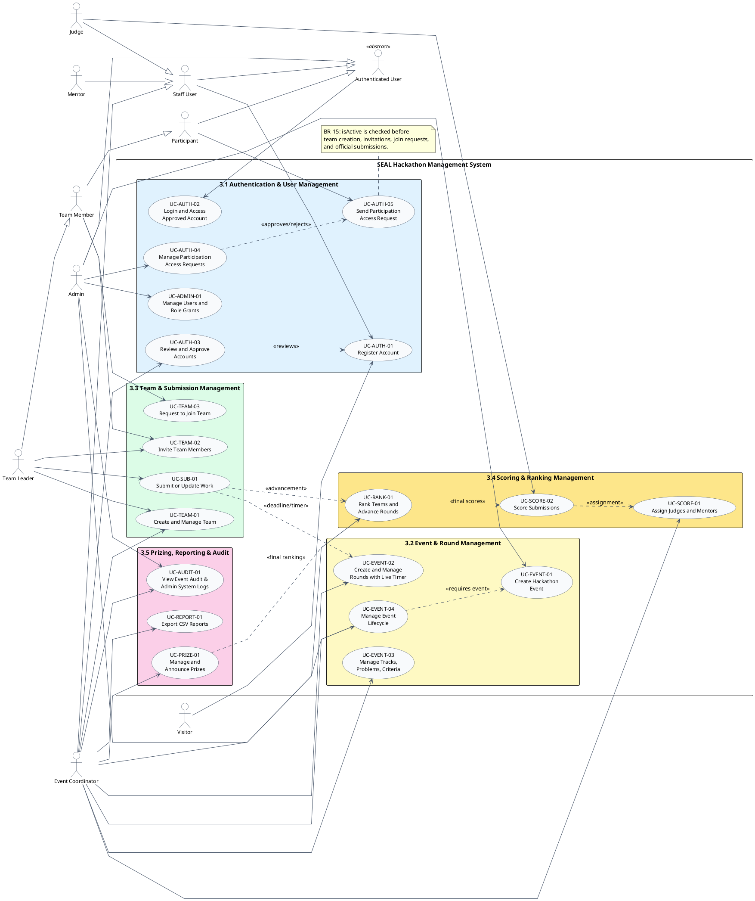
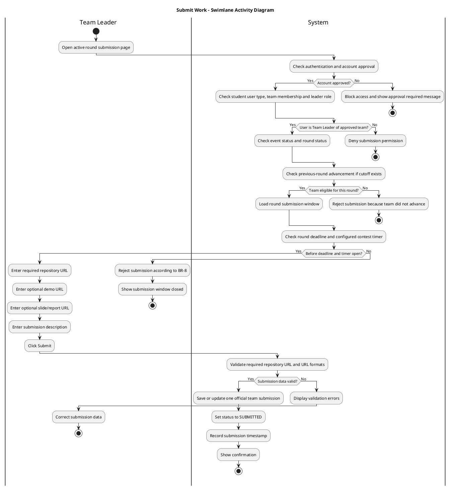
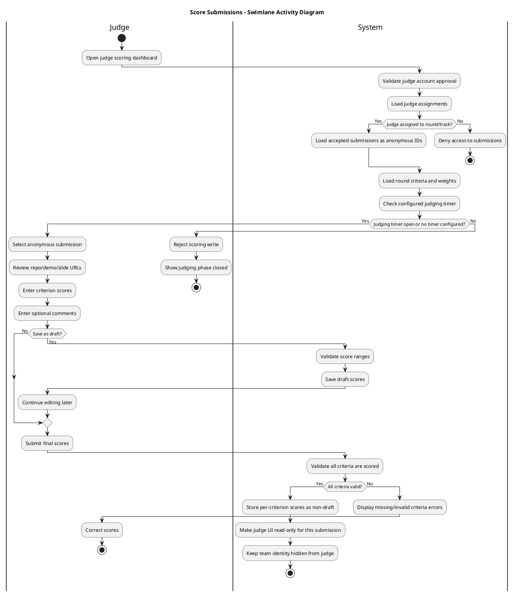

# 3. Chức Năng Hệ Thống, Use Case và Business Rules

Tài liệu này là bản tiếng Việt để review nội dung cho phần **3. System Features** của dự án **SEAL - Software Engineering Hackathon Management System**. Các mã Use Case, Functional Requirement và Business Rule được giữ nguyên để dễ đối chiếu với bản tiếng Anh trong báo cáo chính.

## 3.0 Danh Sách Chức Năng Hệ Thống Theo Module

| Module | Feature ID | Chức năng hệ thống | Actor chính | Priority |
|---|---:|---|---|---|
| 3.1 Authentication and User Management | UC-AUTH-01 | Đăng ký tài khoản | FPT Student, External Student, Staff User | High |
| 3.1 Authentication and User Management | UC-AUTH-02 | Đăng nhập và truy cập tài khoản đã duyệt | Tất cả người dùng đã đăng ký | High |
| 3.1 Authentication and User Management | UC-AUTH-03 | Review và duyệt tài khoản | Event Coordinator | High |
| 3.1 Authentication and User Management | UC-AUTH-04 | Quản lý yêu cầu Participation Access | Admin | High |
| 3.1 Authentication and User Management | UC-AUTH-05 | Gửi yêu cầu Participation Access | Team Member, Team Leader | High |
| 3.1 Authentication and User Management | UC-ADMIN-01 | Quản lý người dùng và phân quyền | Admin | High |
| 3.2 Event and Round Management | UC-EVENT-01 | Tạo sự kiện Hackathon | Admin | High |
| 3.2 Event and Round Management | UC-EVENT-04 | Quản lý vòng đời Event | Admin, Event Coordinator | High |
| 3.2 Event and Round Management | UC-EVENT-02 | Tạo và quản lý vòng thi kèm Live Timer | Event Coordinator | High |
| 3.2 Event and Round Management | UC-EVENT-03 | Quản lý Track, đề bài và tiêu chí chấm điểm | Event Coordinator | High |
| 3.3 Team and Submission Management | UC-TEAM-01 | Tạo và quản lý đội thi | Team Leader, Event Coordinator | High |
| 3.3 Team and Submission Management | UC-TEAM-02 | Mời thành viên vào đội | Team Leader, Team Member | High |
| 3.3 Team and Submission Management | UC-TEAM-03 | Gửi yêu cầu tham gia đội | Team Member, Team Leader | High |
| 3.3 Team and Submission Management | UC-SUB-01 | Nộp hoặc cập nhật bài dự thi | Team Leader | High |
| 3.4 Scoring and Ranking Management | UC-SCORE-01 | Phân công Judge và Mentor | Event Coordinator | High |
| 3.4 Scoring and Ranking Management | UC-SCORE-02 | Chấm điểm bài nộp | Judge | High |
| 3.4 Scoring and Ranking Management | UC-RANK-01 | Xếp hạng đội và xét đội vào vòng tiếp theo | System, Event Coordinator | High |
| 3.5 Prizing and Reporting | UC-PRIZE-01 | Quản lý và công bố giải thưởng | Event Coordinator | Medium |
| 3.5 Prizing and Reporting | UC-REPORT-01 | Xuất báo cáo CSV | Event Coordinator | Medium |
| 3.5 Prizing and Reporting | UC-AUDIT-01 | Xem Event Audit Logs và Admin System Logs | Event Coordinator (event audit), Admin | Medium |

## 3.0.1 Sơ Đồ Use Case Tổng Thể

## 3.0.2 Danh Mục Business Rules Dùng Trong Phần 3

| Rule ID | Business Rule |
|---|---|
| BR-1 | Một đội phải có từ 3 đến 5 thành viên. |
| BR-2 | Khi đăng ký, sinh viên FPT phải cung cấp mã số sinh viên FPT; sinh viên trường ngoài phải cung cấp mã số sinh viên và tên trường đại học. |
| BR-3 | Một participant chỉ được thuộc một team trong cùng một event. |
| BR-4 | Team được tạo chưa có track ban đầu; track assignment diễn ra trong giai đoạn `SETUP` thông qua leader self-selection hoặc coordinator random/manual assignment. |
| BR-5 | Mỗi mùa chỉ được có một event, và thời gian event không được trùng lặp. |
| BR-6 | Event lifecycle transitions phải theo sequence đang triển khai `DRAFT`, `OPEN`, `SETUP`, `IN_PROGRESS`, `COMPLETED`, `CANCELLED`; complete/reopen event chỉ dành cho Admin. |
| BR-7 | Round timer có contest phase và judging phase; nếu một phase có timer, write operations của phase đó yêu cầu timer đang chạy. |
| BR-8 | Submission chỉ được chấp nhận trước deadline của round và khi contest timer chưa kết thúc. |
| BR-9 | Chỉ tài khoản đã được duyệt mới được đăng nhập và tham gia hệ thống. |
| BR-10 | Event chỉ được vào `IN_PROGRESS` khi setup hoàn tất: mỗi track có ít nhất hai approved teams và không còn approved team chưa được assign. |
| BR-11 | Ở non-final rounds, judge assignments theo track; ở final round, judge assignments theo toàn event. |
| BR-12 | Tổng điểm của team được tính bằng trung bình cộng normalized judge totals; mỗi judge total dựa trên criterion value, criterion maximum score và criterion weight. |
| BR-13 | Ranking ties được xử lý bằng accepted submission timestamp sớm hơn; team không có submission timestamp được xếp sau team đã submit. |
| BR-14 | Platform accounts do Admin tạo được pre-approved; operational roles được grant hoặc revoke rõ ràng thông qua role grants. |
| BR-15 | Student account đã approved nhưng `isActive = false` chỉ có quyền read-only cho đến khi System Admin duyệt participation access request. |
| BR-20 | Judge phải chấm ẩn danh và không được biết tên team hoặc danh tính thành viên khi chấm. |
| BR-21 | Tổng trọng số của tất cả tiêu chí chấm điểm trong một round phải bằng đúng 1.0, tương đương 100%. |

## 3.1 Authentication and User Management

### 3.1.1 UC-AUTH-01 - Register Account

#### Description
Use case này cho phép người dùng mới tạo tài khoản SEAL bằng cách cung cấp thông tin định danh, liên hệ, thông tin đăng nhập và loại người dùng. Tài khoản sau khi tạo được active nhưng chưa được duyệt (`isApproved = false`) và chưa được tham gia hệ thống cho đến khi Event Coordinator duyệt.

#### Priority
High.

#### Actor
Primary actors: FPT Student, External Student, Staff User.  
Supporting actor: System.

#### Preconditions
- Người dùng chưa có tài khoản với email tương tự.
- Trang đăng ký đang hoạt động.
- Người dùng có thể cung cấp đầy đủ thông tin định danh bắt buộc.

#### Trigger
Người dùng chọn chức năng đăng ký từ giao diện public của SEAL.

#### Main Flow
1. Người dùng mở trang đăng ký.
2. Hệ thống hiển thị form đăng ký.
3. Người dùng nhập họ tên, email, mật khẩu, số điện thoại nếu có và user type.
4. Nếu người dùng khai báo là sinh viên FPT, hệ thống yêu cầu mã số sinh viên FPT.
5. Nếu người dùng khai báo là sinh viên trường ngoài, hệ thống yêu cầu mã số sinh viên và tên trường đại học.
6. Người dùng gửi form đăng ký.
7. Hệ thống kiểm tra các trường bắt buộc, định dạng email, chính sách mật khẩu và dữ liệu loại sinh viên.
8. Hệ thống kiểm tra email có bị trùng hay không.
9. Hệ thống tạo tài khoản mới với `isApproved = false`.
10. Hệ thống thông báo tài khoản đang chờ Event Coordinator duyệt.

#### Alternative Flow
- A1 - Hoàn thiện hồ sơ khi đăng nhập bằng social account:
  1. Người dùng đăng nhập bằng nhà cung cấp xác thực bên ngoài.
  2. Hệ thống phát hiện hồ sơ SEAL chưa đầy đủ.
  3. Hệ thống chuyển người dùng sang trang bổ sung thông tin sinh viên cho `FPT_STUDENT` hoặc `EXTERNAL_STUDENT`.
  4. Sau khi hoàn tất, hệ thống vẫn giữ tài khoản ở trạng thái chưa được duyệt cho đến khi Event Coordinator approve.
- A2 - Tài khoản guest judge:
  1. Guest judge được ban tổ chức mời tham gia.
  2. Hệ thống ghi nhận tài khoản judge sau khi Admin hoặc Coordinator thiết lập.
  3. Sau khi được duyệt, tài khoản chỉ có quyền trong phạm vi chấm điểm được phân công.

#### Exception Flow
- E1 - Email bị trùng: Hệ thống từ chối đăng ký và báo email đã được sử dụng.
- E2 - Thiếu mã số sinh viên FPT: Hệ thống từ chối đăng ký của sinh viên FPT.
- E3 - Thiếu tên trường ngoài: Hệ thống từ chối đăng ký của sinh viên ngoài FPT.
- E4 - Dữ liệu không hợp lệ: Hệ thống hiển thị lỗi validation.
- E5 - Lỗi hệ thống: Hệ thống không tạo tài khoản và yêu cầu người dùng thử lại.

#### Postconditions
- Một tài khoản mới được tạo với `isApproved = false`.
- Người dùng chưa thể đăng nhập hoặc tham gia cho đến khi được duyệt.
- Tài khoản xuất hiện trong danh sách chờ duyệt của Event Coordinator.

#### Functional Requirements
- AUTH-01: Hệ thống phải cho phép người dùng public đăng ký tài khoản bằng email, mật khẩu, họ tên và dữ liệu hồ sơ theo user type.
- AUTH-02: Hệ thống phải yêu cầu thông tin loại sinh viên khi đăng ký participant.
- AUTH-03: Hệ thống phải kiểm tra email đăng ký là duy nhất.
- AUTH-04: Hệ thống phải tạo tài khoản mới ở trạng thái chưa được duyệt.
- AUTH-05: Hệ thống phải hiển thị thông báo chờ duyệt sau khi đăng ký thành công.

#### Business Rules
- BR-2: Sinh viên FPT phải cung cấp mã số sinh viên FPT; sinh viên trường ngoài phải cung cấp mã số sinh viên và tên trường đại học.
- BR-9: Chỉ tài khoản đã được duyệt mới được đăng nhập và tham gia hệ thống.

### 3.1.2 UC-AUTH-02 - Login and Access Approved Account

#### Description
Use case này cho phép người dùng đã được duyệt đăng nhập và truy cập các chức năng theo vai trò. Các tài khoản chưa được duyệt hoặc bị vô hiệu hóa sẽ bị chặn.

#### Priority
High.

#### Actor
Primary actors: Team Member, Team Leader, Judge, Mentor, Event Coordinator, Admin.  
Supporting actor: System.

#### Preconditions
- Người dùng đã đăng ký tài khoản.
- Tài khoản tồn tại trong hệ thống.
- Người dùng có thông tin đăng nhập hợp lệ.

#### Trigger
Người dùng gửi email và mật khẩu trên trang đăng nhập.

#### Main Flow
1. Người dùng mở trang đăng nhập.
2. Người dùng nhập email và mật khẩu.
3. Hệ thống xác thực thông tin đăng nhập.
4. Hệ thống kiểm tra trạng thái duyệt của tài khoản.
5. Nếu `isApproved = true`, hệ thống tạo session hoặc JWT token.
6. Hệ thống tải vai trò và quyền của người dùng.
7. Hệ thống chuyển người dùng đến dashboard phù hợp.
8. Hệ thống chỉ cho phép truy cập các chức năng đúng với vai trò.

#### Alternative Flow
- A1 - Người dùng có nhiều vai trò:
  1. Người dùng đã được duyệt có nhiều vai trò, ví dụ Mentor và Judge.
  2. Hệ thống hiển thị các role context có thể chọn.
  3. Người dùng chọn context cho phiên làm việc hiện tại.
  4. Hệ thống tải dashboard và quyền tương ứng.
- A2 - Cập nhật hồ sơ:
  1. Người dùng đăng nhập thành công.
  2. Người dùng mở phần profile.
  3. Hệ thống cho phép cập nhật các trường hồ sơ được phép chỉnh sửa.

#### Exception Flow
- E1 - Sai thông tin đăng nhập: Hệ thống từ chối đăng nhập.
- E2 - Tài khoản đang chờ duyệt: Hệ thống từ chối đăng nhập và báo cần được Coordinator duyệt.
- E3 - Tài khoản chưa được duyệt, bị từ chối hoặc inactive: Hệ thống từ chối truy cập.
- E4 - Truy cập trang không có quyền: Hệ thống chặn request và chuyển đến trang phù hợp hoặc trang access denied.

#### Postconditions
- Người dùng chỉ được xác thực nếu tài khoản đã được duyệt.
- Session hoặc JWT hợp lệ được cấp cho người dùng đã được duyệt.
- Role-based access control được áp dụng cho các request tiếp theo.

#### Functional Requirements
- AUTH-06: Hệ thống phải xác thực người dùng bằng email/mật khẩu hoặc nhà cung cấp đăng nhập ngoài được hỗ trợ.
- AUTH-07: Hệ thống phải từ chối xác thực tài khoản có `isApproved` không phải true.
- AUTH-08: Hệ thống phải cấp token bảo mật sau khi đăng nhập thành công.
- AUTH-09: Hệ thống phải áp dụng phân quyền theo vai trò cho tất cả chức năng được bảo vệ.
- AUTH-10: Hệ thống phải cho phép người dùng đã đăng nhập xem hồ sơ cá nhân.

#### Business Rules
- BR-9: Chỉ tài khoản đã được duyệt mới được đăng nhập và tham gia hệ thống.

### 3.1.3 UC-AUTH-03 - Review and Approve Accounts

#### Description
Use case này cho phép Event Coordinator review tài khoản mới đăng ký, kiểm tra thông tin hồ sơ, duyệt tài khoản hợp lệ hoặc từ chối tài khoản không hợp lệ. Khi được duyệt, hệ thống chuyển `isApproved` từ false sang true.

#### Priority
High.

#### Actor
Primary actor: Event Coordinator.  
Supporting actor: System.

#### Preconditions
- Actor đã đăng nhập với quyền Event Coordinator.
- Có ít nhất một tài khoản có `isApproved = false`.
- Actor có quyền review tài khoản.

#### Trigger
Event Coordinator mở danh sách tài khoản chờ duyệt.

#### Main Flow
1. Event Coordinator mở trang pending accounts.
2. Hệ thống hiển thị danh sách tài khoản chờ duyệt.
3. Event Coordinator chọn một tài khoản.
4. Hệ thống hiển thị hồ sơ, role request và thông tin loại sinh viên.
5. Event Coordinator kiểm tra thông tin.
6. Event Coordinator chọn `Approve`.
7. Hệ thống đặt `isApproved = true`.
8. Hệ thống ghi nhận hành động duyệt.
9. Hệ thống thông báo cho người dùng rằng tài khoản đã được duyệt.

#### Alternative Flow
- A1 - Từ chối tài khoản:
  1. Event Coordinator phát hiện thông tin sai, thiếu hoặc đáng ngờ.
  2. Event Coordinator chọn `Reject` và nhập lý do.
  3. Hệ thống giữ tài khoản ở trạng thái chưa được duyệt và ghi nhận quyết định từ chối.
  4. Hệ thống thông báo cho người dùng nếu phù hợp.

#### Exception Flow
- E1 - Actor không có quyền: Hệ thống từ chối truy cập approval queue.
- E2 - Tài khoản đã được xử lý: Hệ thống ngăn duyệt/từ chối trùng lặp.
- E3 - Thiếu dữ liệu review bắt buộc: Hệ thống chặn duyệt đến khi có đủ thông tin.
- E4 - Lỗi hệ thống: Hệ thống giữ nguyên trạng thái cũ và hiển thị lỗi.

#### Postconditions
- Người dùng được duyệt có thể đăng nhập và tham gia theo vai trò.
- Người dùng bị từ chối hoặc vẫn chưa được duyệt không thể đăng nhập hoặc tham gia.
- Quyết định duyệt hoặc từ chối được ghi nhận.

#### Functional Requirements
- AUTH-11: Hệ thống phải cho phép Event Coordinator xem danh sách tài khoản pending.
- AUTH-12: Hệ thống phải hiển thị dữ liệu định danh và loại sinh viên để review.
- AUTH-13: Hệ thống phải cho phép Event Coordinator duyệt tài khoản pending.
- AUTH-14: Hệ thống phải cho phép Event Coordinator từ chối tài khoản pending kèm lý do.
- AUTH-15: Hệ thống phải thông báo cho người dùng khi trạng thái duyệt thay đổi.

#### Business Rules
- BR-2: Sinh viên FPT phải cung cấp mã số sinh viên FPT; sinh viên trường ngoài phải cung cấp mã số sinh viên và tên trường đại học.
- BR-9: Chỉ tài khoản đã được duyệt mới được đăng nhập và tham gia hệ thống.

### 3.1.4 UC-AUTH-04 - Manage Participation Access Requests

#### Description
Use case này cho phép System Admin review, approve hoặc reject các participation access requests do approved student accounts gửi. Khi approve, hệ thống đặt `isActive = true` để khôi phục quyền participant write access.

#### Priority
High.

#### Actor
Primary actor: Admin.  
Supporting actor: System.

#### Preconditions
- Admin account đã được duyệt và đăng nhập.
- Admin có quyền `SYSTEM_ADMIN`.
- Có ít nhất một participation access request ở trạng thái `PENDING`.

#### Trigger
Admin mở trang Participation Requests.

#### Main Flow
1. Admin mở trang Admin Participation Requests.
2. Hệ thống kiểm tra quyền `SYSTEM_ADMIN` của Admin.
3. Hệ thống hiển thị pending participation access requests theo thứ tự mới nhất trước.
4. Admin chọn một pending request.
5. Hệ thống hiển thị identity data, user type, email và request timestamp của requester.
6. Admin chọn `Approve`.
7. Hệ thống đặt request status thành `APPROVED`.
8. Hệ thống đặt `isActive = true` cho student.
9. Hệ thống ghi nhận Admin action vào system logs.
10. Hệ thống thông báo cho student rằng participation access đã được duyệt.

#### Alternative Flow
- A1 - Reject participation request:
  1. Admin chọn một pending request.
  2. Admin chọn `Reject`.
  3. Hệ thống đánh dấu request là rejected và giữ student account ở read-only mode.
  4. Hệ thống ghi nhận rejection vào system logs và thông báo cho student.
- A2 - Không có pending requests:
  1. Admin mở trang Participation Requests.
  2. Hệ thống hiển thị empty state.

#### Exception Flow
- E1 - Actor không có quyền: Hệ thống từ chối request management access với non-admin actors.
- E2 - Request đã được xử lý: Hệ thống chặn approve/reject trùng lặp.
- E3 - Request không tồn tại: Hệ thống hiển thị lỗi và không cập nhật user nào.
- E4 - Lỗi hệ thống: Hệ thống giữ nguyên request status và user status hiện tại.

#### Postconditions
- Nếu approved, student account trở thành active và có thể thực hiện participant write actions.
- Nếu rejected, student account vẫn ở read-only mode.
- Quyết định xử lý request được lưu kèm metadata và system log.

#### Functional Requirements
- AUTH-19: Hệ thống phải cho phép Admin list pending participation access requests.
- AUTH-20: Hệ thống phải cho phép Admin approve participation access requests và set `isActive = true`.
- AUTH-21: Hệ thống phải cho phép Admin reject participation access requests.
- AUTH-22: Hệ thống phải notify student và ghi system logs sau khi request được xử lý.

#### Business Rules
- BR-9: Chỉ tài khoản đã được duyệt mới được đăng nhập và tham gia hệ thống.
- BR-15: Student account đã approved nhưng `isActive = false` chỉ có quyền read-only cho đến khi System Admin duyệt participation access request.

### 3.1.5 UC-AUTH-05 - Send Participation Access Request

#### Description
Use case này cho phép student account đã approved nhưng đang ở read-only mode gửi participation access request. Request này yêu cầu System Admin re-activate participant write access bằng cách đặt `isActive = true`.

#### Priority
High.

#### Actor
Primary actors: Team Member, Team Leader.  
Supporting actor: System.

#### Preconditions
- Student account đã được duyệt và đăng nhập.
- User type của student là `FPT_STUDENT` hoặc `EXTERNAL_STUDENT`.
- Student account có `isActive = false`.

#### Trigger
Team Member hoặc Team Leader chọn `Request Participation Access` từ một participant screen đang read-only.

#### Main Flow
1. Student đăng nhập thành công bằng account đã approved.
2. Hệ thống phát hiện `isActive = false` và chỉ cho read-only access.
3. Student thử thực hiện participant write workflow như tạo team, accept invitation, request join team hoặc submit work.
4. Hệ thống chặn write action và hiển thị option request participation access.
5. Student chọn `Request Participation Access`.
6. Hệ thống kiểm tra user là approved inactive student.
7. Hệ thống tạo participation access request ở trạng thái pending.
8. Hệ thống xác nhận request đã được gửi để Admin review.

#### Alternative Flow
- A1 - Đã có pending request:
  1. Student gửi request khi đã có một pending request.
  2. Hệ thống trả về pending request hiện có thay vì tạo request trùng.
- A2 - Read-only browsing:
  1. Inactive student xem dashboard, teams hoặc event information.
  2. Hệ thống cho phép read-only access và chưa yêu cầu request cho đến khi student muốn participate.

#### Exception Flow
- E1 - Account chưa approved: Hệ thống chặn tạo participation access request.
- E2 - Không phải student account: Hệ thống chặn tạo participation access request.
- E3 - Account đã active: Hệ thống từ chối request vì đã có participation access.
- E4 - Lỗi hệ thống: Hệ thống không tạo request và hiển thị retry message.

#### Postconditions
- Một pending participation access request tồn tại để Admin review.
- Student vẫn ở read-only mode cho đến khi request được approve.
- Hệ thống không tạo duplicate pending requests.

#### Functional Requirements
- AUTH-16: Hệ thống phải cho phép approved inactive student accounts gửi participation access requests.
- AUTH-17: Hệ thống phải chặn non-student hoặc unapproved accounts gửi participation access requests.
- AUTH-18: Hệ thống phải ngăn duplicate pending participation access requests cho cùng một user.
- AUTH-23: Hệ thống phải chặn participant write actions khi `isActive = false`.
- AUTH-24: Hệ thống phải hiển thị option request access khi inactive student cố gắng participate.

#### Business Rules
- BR-9: Chỉ tài khoản đã được duyệt mới được đăng nhập và tham gia hệ thống.
- BR-15: Student account đã approved nhưng `isActive = false` chỉ có quyền read-only cho đến khi System Admin duyệt participation access request.

### 3.1.6 UC-ADMIN-01 - Manage Users and Role Grants

#### Description
Use case này cho phép System Admin quản lý platform users, tạo tài khoản staff/user đã được pre-approved, cập nhật dữ liệu hồ sơ được phép chỉnh sửa, grant hoặc revoke system/event roles, và xem platform-level system logs. Chức năng này phản ánh Admin module hiện tại, trong đó account approval và role grants là hai nghiệp vụ riêng.

#### Priority
High.

#### Actor
Primary actor: Admin.  
Supporting actors: System, Event Coordinator, Judge, Mentor.

#### Preconditions
- Tài khoản Admin đã được duyệt và đăng nhập.
- Admin có quyền `SYSTEM_ADMIN`.
- Target users, roles và event scope tùy chọn đã tồn tại khi grant hoặc revoke role.

#### Trigger
Admin mở trang Admin user management hoặc chọn action grant/revoke role.

#### Main Flow
1. Admin mở trang Admin users.
2. Hệ thống kiểm tra quyền `SYSTEM_ADMIN` của Admin.
3. Hệ thống hiển thị user records và role grants hiện có.
4. Admin chọn một user hoặc tạo user account mới.
5. Với user mới, Admin nhập email, name, password, user type, phone và judge type nếu có.
6. Hệ thống tạo user ở trạng thái active và approved.
7. Admin chọn role cần grant, ví dụ Event Coordinator, Judge, Mentor hoặc role được hỗ trợ khác.
8. Admin chọn event scope nếu role là event-scoped.
9. Hệ thống kiểm tra role grant không bị trùng.
10. Hệ thống lưu role grant.
11. Hệ thống ghi nhận admin action vào system logs.

#### Alternative Flow
- A1 - Revoke role:
  1. Admin mở role grants của user hiện có.
  2. Admin chọn role grant cần revoke.
  3. Hệ thống xóa grant và ghi nhận revocation vào system logs.
- A2 - Cập nhật dữ liệu hồ sơ được phép chỉnh sửa:
  1. Admin mở user profile.
  2. Admin cập nhật các trường được phép như full name, phone, university, student ID hoặc judge type.
  3. Hệ thống lưu profile update mà không thay đổi các identity fields bất biến như email.
- A3 - Xem system logs:
  1. Admin mở trang System Logs.
  2. Hệ thống hiển thị platform/admin actions theo thứ tự mới nhất trước.

#### Exception Flow
- E1 - Actor không phải Admin: Hệ thống từ chối truy cập tất cả Admin endpoints.
- E2 - Email bị trùng: Hệ thống từ chối tạo account.
- E3 - Role grant bị trùng: Hệ thống không lưu cùng một role grant hai lần.
- E4 - Event scope không hợp lệ: Hệ thống từ chối event-scoped role grant khi event không tồn tại.
- E5 - Role operation không hợp lệ: Hệ thống từ chối role name không hỗ trợ hoặc revoke grant không tồn tại.

#### Postconditions
- Account do Admin tạo ở trạng thái active và approved.
- Role grants phản ánh quyền hiện tại của user.
- Các hành động grant, revoke và tạo user được ghi nhận trong system logs.

#### Functional Requirements
- ADMIN-01: Hệ thống phải giới hạn Admin user management cho user có quyền `SYSTEM_ADMIN`.
- ADMIN-02: Hệ thống phải cho phép Admin list và xem platform users.
- ADMIN-03: Hệ thống phải cho phép Admin tạo user account active và approved.
- ADMIN-04: Hệ thống phải cho phép Admin cập nhật các trường profile được phép chỉnh sửa.
- ADMIN-05: Hệ thống phải cho phép Admin grant và revoke system hoặc event-scoped roles.
- ADMIN-06: Hệ thống phải ghi nhận Admin actions trong platform system logs.

#### Business Rules
- BR-9: Chỉ tài khoản đã được duyệt mới được đăng nhập và tham gia hệ thống.
- BR-14: Platform accounts do Admin tạo được pre-approved; operational roles được grant hoặc revoke rõ ràng thông qua role grants.

## 3.2 Event and Round Management

### 3.2.1 UC-EVENT-01 - Create Hackathon Event

#### Description
Use case này cho phép Admin tạo event shell chính cho một mùa SEAL Hackathon. Việc tạo event được tách khỏi vận hành lifecycle vì endpoint create event hiện tại chỉ dành cho `SYSTEM_ADMIN`.

#### Priority
High.

#### Actor
Primary actor: Admin.  
Supporting actor: System.

#### Preconditions
- Admin đã đăng nhập và được duyệt.
- Admin có quyền `SYSTEM_ADMIN`.
- Hệ thống có dữ liệu event hiện có để kiểm tra trùng lịch.

#### Trigger
Admin chọn `Create Event`.

#### Main Flow
1. Admin mở trang quản lý event.
2. Hệ thống hiển thị danh sách event và trạng thái.
3. Admin chọn `Create Event`.
4. Hệ thống hiển thị form event.
5. Admin nhập tên event, season, year, mô tả, thời gian đăng ký, ngày bắt đầu, ngày kết thúc, trạng thái ban đầu và track selection mode.
6. Admin gửi form.
7. Hệ thống kiểm tra trường bắt buộc và thứ tự ngày tháng.
8. Hệ thống kiểm tra không có active event khác trong cùng season/year và không bị trùng thời gian với active event khác.
9. Hệ thống tạo event, thông thường ở trạng thái `DRAFT`.
10. Hệ thống ghi nhận create event action.

#### Alternative Flow
- A1 - Tạo event với initial status cụ thể:
  1. Admin chọn một initial status hợp lệ.
  2. Hệ thống kiểm tra status và tạo event với status đó.
- A2 - Chọn track assignment mode:
  1. Admin chọn `SELF_SELECT` hoặc `RANDOM`.
  2. Hệ thống lưu mode này để dùng cho track assignment trong setup phase.

#### Exception Flow
- E1 - Event bị trùng lịch: Hệ thống từ chối tạo event.
- E2 - Trùng season: Hệ thống từ chối vì season đã có event.
- E3 - Khoảng ngày không hợp lệ: Hệ thống hiển thị lỗi validation.
- E4 - Season/year hoặc status không hợp lệ: Hệ thống từ chối create event request.
- E5 - Actor không có quyền: Hệ thống từ chối quyền tạo event.

#### Postconditions
- Event hợp lệ được tạo.
- Event sẵn sàng cho lifecycle management, round setup, track setup và team registration theo status.
- Event sai hoặc trùng lịch không được lưu.

#### Functional Requirements
- EVENT-01: Hệ thống phải cho phép Admin tạo hackathon event với season, year, date range, registration window và description.
- EVENT-02: Hệ thống phải kiểm tra event không trùng thời gian với event khác.
- EVENT-03: Hệ thống phải đảm bảo mỗi season chỉ có một event.
- EVENT-04: Hệ thống phải hỗ trợ track selection mode `SELF_SELECT` và `RANDOM` khi tạo event.
- EVENT-05: Hệ thống phải ghi nhận event creation để phục vụ accountability.

#### Business Rules
- BR-5: Mỗi mùa chỉ được có một event, và thời gian event không được trùng lặp.

### 3.2.2 UC-EVENT-04 - Manage Event Lifecycle

#### Description
Use case này cho phép Event Coordinator và Admin cập nhật các trạng thái lifecycle được phép sau khi event đã được tạo. Event Coordinator vận hành lifecycle thi đấu thông thường, còn Admin thực hiện các hành động terminal bị giới hạn như complete hoặc reopen event.

#### Priority
High.

#### Actor
Primary actors: Event Coordinator, Admin.  
Supporting actor: System.

#### Preconditions
- Actor đã đăng nhập và được duyệt.
- Hackathon event đã tồn tại.
- Actor có vai trò phù hợp với lifecycle action được yêu cầu.
- Team, track và setup data đã sẵn sàng khi event vào `SETUP` hoặc `IN_PROGRESS`.

#### Trigger
Event Coordinator hoặc Admin chọn một event status action.

#### Main Flow
1. Actor mở trang event management.
2. Hệ thống hiển thị các event và lifecycle status hiện tại.
3. Actor chọn một status transition được phép.
4. Hệ thống kiểm tra transition với transition map đã implement.
5. Nếu event vào `SETUP`, hệ thống đóng normal registration và tính track capacities từ approved teams.
6. Nếu event vào `IN_PROGRESS`, hệ thống kiểm tra setup đã hoàn tất.
7. Hệ thống lưu event status mới.
8. Hệ thống bật hoặc tắt các downstream functions theo status mới.

#### Alternative Flow
- A1 - Roll back operational status:
  1. Event Coordinator chuyển event lùi theo transition được phép, ví dụ `SETUP` về `OPEN`.
  2. Hệ thống kiểm tra transition và cập nhật status.
- A2 - Cancel hoặc reactivate event:
  1. Event Coordinator cancel event từ một operational state chưa terminal.
  2. Hệ thống chuyển status thành `CANCELLED`.
  3. Nếu được phép, actor reactivate event đã cancelled về `DRAFT`.
- A3 - Complete event:
  1. Admin chuyển event `IN_PROGRESS` sang `COMPLETED`.
  2. Hệ thống kiểm tra quyền Admin và cập nhật status.
- A4 - Reopen completed event:
  1. Admin reopen một event `COMPLETED`.
  2. Hệ thống kiểm tra quyền Admin và chuyển status về `IN_PROGRESS`.

#### Exception Flow
- E1 - Lifecycle transition không hợp lệ: Hệ thống chặn status change không được hỗ trợ.
- E2 - Setup chưa hoàn tất: Hệ thống không cho chuyển từ `SETUP` sang `IN_PROGRESS` nếu track assignment hoặc minimum team count theo track chưa hợp lệ.
- E3 - Actor không có quyền: Hệ thống từ chối các lifecycle action bị giới hạn.
- E4 - Event không tồn tại: Hệ thống hiển thị lỗi và không cập nhật status.
- E5 - Schedule conflict khi reactivate: Hệ thống từ chối reactivation nếu vi phạm uniqueness hoặc overlap rules.

#### Postconditions
- Event status chỉ được cập nhật khi transition hợp lệ.
- Team registration, setup actions, submissions, scoring, results và reporting tuân theo lifecycle status mới.
- Lifecycle request không hợp lệ không làm thay đổi event.

#### Functional Requirements
- EVENT-17: Hệ thống phải hỗ trợ event statuses `DRAFT`, `OPEN`, `SETUP`, `IN_PROGRESS`, `COMPLETED` và `CANCELLED`.
- EVENT-18: Hệ thống phải enforce event lifecycle transition map đã implement.
- EVENT-19: Hệ thống phải tính track capacities khi event vào `SETUP`.
- EVENT-20: Hệ thống phải kiểm tra setup completeness trước khi cho `SETUP` chuyển sang `IN_PROGRESS`.
- EVENT-21: Hệ thống phải giới hạn complete và reopen event cho Admin.
- EVENT-22: Hệ thống phải áp dụng event status vào availability của downstream features.

#### Business Rules
- BR-6: Event lifecycle transitions phải theo sequence đang triển khai `DRAFT`, `OPEN`, `SETUP`, `IN_PROGRESS`, `COMPLETED`, `CANCELLED`; complete/reopen event chỉ dành cho Admin.
- BR-10: Event chỉ được vào `IN_PROGRESS` khi setup hoàn tất: mỗi track có ít nhất hai approved teams và không còn approved team chưa được assign.

### 3.2.3 UC-EVENT-02 - Create and Manage Rounds with Live Timer

#### Description
Use case này cho phép Event Coordinator cấu hình các round, deadline nộp bài, top-N advancement và vận hành live timer server-authoritative cho cả contest phase và judging phase.

#### Priority
High.

#### Actor
Primary actor: Event Coordinator.  
Supporting actors: System, Team Leader, Judge.

#### Preconditions
- Event Coordinator đã đăng nhập và có quyền.
- Hackathon event đã tồn tại.
- Event chưa ở trạng thái `COMPLETED` hoặc trạng thái không cho quản lý round.

#### Trigger
Event Coordinator mở phần quản lý round của event.

#### Main Flow
1. Event Coordinator chọn một event.
2. Hệ thống hiển thị danh sách round của event.
3. Event Coordinator chọn `Create Round`.
4. Hệ thống hiển thị các trường cấu hình round.
5. Event Coordinator nhập tên round, order number, thời gian bắt đầu, thời gian kết thúc, deadline nộp bài, trạng thái, final-round flag và top-N advancement.
6. Event Coordinator lưu round.
7. Hệ thống kiểm tra thứ tự thời gian, thứ tự round là duy nhất và các trường bắt buộc.
8. Hệ thống tạo round.
9. Khi cuộc thi bắt đầu, Event Coordinator start timer phase `CONTEST`.
10. Hệ thống chuyển round sang trạng thái thi đấu active và đồng bộ submission deadline từ thời điểm timer kết thúc nếu có.
11. Hệ thống hiển thị live timer cho participant.
12. Khi judging bắt đầu, Event Coordinator có thể start timer phase `JUDGING`.
13. Khi timer đã cấu hình kết thúc hoặc deadline đã qua, hệ thống xem write window tương ứng là đã đóng.

#### Alternative Flow
- A1 - Gia hạn timer:
  1. Event Coordinator chọn timer đang chạy.
  2. Event Coordinator nhập thời lượng cần gia hạn.
  3. Hệ thống cập nhật thời gian còn lại và hiển thị trạng thái timer mới.
- A2 - Pause hoặc resume timer:
  1. Event Coordinator pause timer vì lý do vận hành.
  2. Hệ thống dừng countdown và hiển thị trạng thái paused.
  3. Event Coordinator resume timer.
- A3 - Cấu hình final round:
  1. Event Coordinator đánh dấu một round là final.
  2. Hệ thống xử lý ranking và judge assignment cho round này theo scope toàn event thay vì theo track.
- A4 - Quản lý timer phases:
  1. Event Coordinator chọn phase `CONTEST` hoặc `JUDGING`.
  2. Hệ thống tạo hoặc cập nhật timer state cho phase đó.
  3. Participant hoặc Judge chỉ thấy timer state liên quan đến workflow hiện tại.

#### Exception Flow
- E1 - Thời gian round không hợp lệ: Hệ thống từ chối round.
- E2 - Trùng thứ tự round: Hệ thống không cho lưu.
- E3 - Timer đã chạy: Hệ thống chặn start timer khác cho cùng phase.
- E4 - Actor không có quyền: Hệ thống từ chối thao tác.
- E5 - Event đã completed: Hệ thống không cho tạo round hoặc sửa timer.
- E6 - Timer duration quá ngắn: Hệ thống từ chối timer ngắn hơn minimum duration được hỗ trợ.

#### Postconditions
- Round được tạo hoặc cập nhật với timing và advancement hợp lệ.
- Live timer state có sẵn cho participant và judge khi cần.
- Hệ thống có thể kiểm tra submission dựa trên deadline và contest timer.

#### Functional Requirements
- EVENT-06: Hệ thống phải cho phép Event Coordinator tạo và cập nhật round trong event.
- EVENT-07: Hệ thống phải lưu start time, end time, submission deadline, order number, status, final-round flag và top-N advancement value.
- EVENT-08: Hệ thống phải cung cấp live timer cho contest phase và judging phase.
- EVENT-09: Hệ thống phải cho phép coordinator start, pause, resume, stop và extend timer.
- EVENT-10: Hệ thống phải hiển thị remaining timer state cho participant và judge trong phase phù hợp.

#### Business Rules
- BR-7: Round timer có contest phase và judging phase; nếu timer tồn tại cho phase nào thì write operation của phase đó chỉ hợp lệ khi timer đang chạy.
- BR-8: Submission chỉ được chấp nhận trước deadline của round và khi contest timer chưa kết thúc.

### 3.2.4 UC-EVENT-03 - Manage Tracks, Problems, and Scoring Criteria

#### Description
Use case này cho phép Event Coordinator định nghĩa track, quản lý protected problem file theo track và cấu hình tiêu chí chấm điểm có trọng số cho từng round.

#### Priority
High.

#### Actor
Primary actor: Event Coordinator.  
Supporting actors: System, Team Leader, Team Member, Judge.

#### Preconditions
- Event Coordinator đã đăng nhập và có quyền.
- Hackathon event đã tồn tại.
- Cần có ít nhất một round trước khi chốt criteria cho scoring.
- Các thay đổi track chỉ được thực hiện trong trạng thái event mà hệ thống cho phép.

#### Trigger
Event Coordinator mở cấu hình track, problem hoặc criteria.

#### Main Flow
1. Event Coordinator chọn event.
2. Hệ thống hiển thị track, problem và criteria hiện có.
3. Event Coordinator tạo hoặc cập nhật track với tên và mô tả khi event ở trạng thái cho phép chỉnh sửa.
4. Event Coordinator upload hoặc replace protected problem file cho track trong `SETUP` hoặc `IN_PROGRESS`.
5. Event Coordinator chọn round để cấu hình criteria.
6. Event Coordinator nhập tên criterion, mô tả, max score, thứ tự hiển thị và weight.
7. Hệ thống tính tổng weight.
8. Event Coordinator submit criteria set.
9. Hệ thống kiểm tra tổng weight bằng đúng 1.0.
10. Hệ thống lưu criteria và cho judge sử dụng khi scoring.

#### Alternative Flow
- A1 - Import criteria template:
  1. Event Coordinator chọn criteria template đã lưu.
  2. Hệ thống load bộ tiêu chí và weight mặc định.
  3. Event Coordinator điều chỉnh nếu cần.
  4. Hệ thống kiểm tra tổng weight trước khi lưu.
- A2 - Release problem:
  1. Event Coordinator chuyển problem statement sang released.
  2. Hệ thống chỉ cho approved teams thuộc đúng track xem/tải problem.
- A3 - Retract problem:
  1. Event Coordinator retract problem đã release.
  2. Hệ thống chặn participant download cho đến khi release lại.
- A4 - Xóa track trước khi setup bị khóa:
  1. Event Coordinator xóa một track hiện có.
  2. Hệ thống unassign các team đang gắn với track đó nếu cần.
  3. Hệ thống xóa track nếu trạng thái event cho phép.

#### Exception Flow
- E1 - Tổng weight không bằng 1.0: Hệ thống chặn lưu và hiển thị tổng hiện tại.
- E2 - Max score không hợp lệ: Hệ thống từ chối giá trị nhỏ hơn hoặc bằng 0.
- E3 - Trạng thái event không cho chỉnh track: Hệ thống chặn tạo, cập nhật hoặc xóa track ngoài các trạng thái được phép.
- E4 - File problem không hợp lệ: Hệ thống từ chối file sai định dạng hoặc vượt quá kích thước cấu hình.
- E5 - Scoring đã bắt đầu: Hệ thống ngăn sửa criteria nếu làm sai lệch điểm đã có.

#### Postconditions
- Track có sẵn cho team assignment trong giai đoạn `SETUP`.
- Problem đã release có sẵn cho participant hợp lệ.
- Criteria hợp lệ có sẵn cho judge scoring.
- Criteria có tổng weight sai không được lưu.

#### Functional Requirements
- EVENT-11: Hệ thống phải cho phép Event Coordinator tạo, cập nhật và xem competition tracks.
- EVENT-12: Hệ thống phải cho phép Event Coordinator upload, replace, release, retract, download và delete protected track problem statements.
- EVENT-13: Hệ thống phải cho phép Event Coordinator định nghĩa scoring criteria theo round.
- EVENT-14: Hệ thống phải lưu criterion name, description, maximum score, display order và weight.
- EVENT-15: Hệ thống phải từ chối criteria set có tổng weight khác 1.0.
- EVENT-16: Hệ thống chỉ cho approved teams thuộc đúng track truy cập problem file đã release của track đó.

#### Business Rules
- BR-4: Team được tạo chưa có track ban đầu; track assignment diễn ra trong giai đoạn `SETUP` thông qua leader self-selection hoặc coordinator random/manual assignment.
- BR-21: Tổng trọng số của tất cả tiêu chí chấm điểm trong một round phải bằng đúng 1.0, tương đương 100%.

## 3.3 Team and Submission Management

### 3.3.1 UC-TEAM-01 - Create and Manage Team

#### Description
Use case này cho phép participant đã được duyệt tạo và quản lý team cho event `OPEN`. Team được tạo chưa có track; track assignment diễn ra sau đó trong giai đoạn `SETUP` thông qua leader self-selection hoặc coordinator random/manual assignment. Event Coordinator có thể approve, reject hoặc disqualify team.

#### Priority
High.

#### Actor
Primary actor: Team Leader.  
Supporting actors: Event Coordinator, System.

#### Preconditions
- Tài khoản Team Leader đã được duyệt và active.
- Team Leader đã đăng nhập.
- Event được chọn đang ở trạng thái `OPEN` để tạo team.
- Team Leader chưa thuộc team khác trong cùng event.

#### Trigger
Team Leader chọn `Create Team`.

#### Main Flow
1. Team Leader mở trang tạo team.
2. Hệ thống hiển thị các event đang mở cho team registration.
3. Team Leader chọn một event.
4. Team Leader nhập tên team và mô tả.
5. Team Leader submit form tạo team.
6. Hệ thống kiểm tra Team Leader đã được duyệt, active và chưa thuộc team khác trong cùng event.
7. Hệ thống kiểm tra tên team là duy nhất trong event.
8. Hệ thống tạo team với Team Leader là thành viên đầu tiên.
9. Hệ thống đặt team ở trạng thái `PENDING`.
10. Event Coordinator review team sau khi team có thành viên.
11. Nếu team thỏa mãn rule thành viên chính thức, Event Coordinator approve team.

#### Alternative Flow
- A1 - Cập nhật team profile:
  1. Team Leader mở team settings trước khi duyệt cuối.
  2. Team Leader cập nhật description hoặc các trường không bị khóa.
  3. Hệ thống lưu thay đổi.
- A2 - Coordinator reject team:
  1. Event Coordinator thấy team không đạt yêu cầu.
  2. Event Coordinator reject team và nhập lý do.
  3. Hệ thống lưu trạng thái rejected và hiển thị cho Team Leader.
- A3 - Self-select track:
  1. Trong giai đoạn `SETUP`, Team Leader mở action chọn track cho approved team.
  2. Hệ thống kiểm tra event dùng mode `SELF_SELECT` và track còn capacity.
  3. Hệ thống assign team vào track được chọn.
- A4 - Coordinator assign hoặc draw tracks:
  1. Trong giai đoạn `SETUP`, Event Coordinator chạy random track draw hoặc assign thủ công team vào track.
  2. Hệ thống assign approved teams theo action được chọn và ghi nhận thay đổi.
- A5 - Disqualify team:
  1. Event Coordinator chọn team vi phạm chính sách cuộc thi.
  2. Hệ thống đánh dấu team là `DISQUALIFIED` và chặn các hành động thi đấu thông thường tiếp theo.

#### Exception Flow
- E1 - Tài khoản chưa duyệt hoặc inactive: Hệ thống chặn tạo team.
- E2 - Event chưa mở: Hệ thống không cho tạo team cho event đó.
- E3 - User đã thuộc team khác trong event: Hệ thống từ chối request.
- E4 - Team size không hợp lệ khi approve: Hệ thống không cho approve nếu team dưới 3 hoặc trên 5 thành viên.
- E5 - Tên team trùng hoặc không hợp lệ: Hệ thống yêu cầu chỉnh sửa.
- E6 - Không được assign track: Hệ thống chặn self-selection hoặc coordinator assignment ngoài `SETUP` hoặc ngoài mode được cấu hình.

#### Postconditions
- Team được tạo và gắn với một event.
- Team Leader được ghi nhận là leader và member.
- Team chỉ có thể được approve khi số lượng thành viên hợp lệ.
- Track assignment được ghi nhận riêng trong giai đoạn setup của event.

#### Functional Requirements
- TEAM-01: Hệ thống phải cho phép Team Leader đã được duyệt tạo team cho event đang mở.
- TEAM-02: Hệ thống phải tạo team chưa có track ban đầu.
- TEAM-03: Hệ thống phải gán người tạo làm Team Leader.
- TEAM-04: Hệ thống phải quản lý trạng thái team gồm pending, approved, rejected và disqualified nếu có.
- TEAM-05: Hệ thống phải ngăn approve team có ít hơn 3 hoặc nhiều hơn 5 thành viên.
- TEAM-05A: Hệ thống phải hỗ trợ track self-selection cho approved team trong `SETUP` khi event mode là `SELF_SELECT`.
- TEAM-05B: Hệ thống phải hỗ trợ coordinator random draw và manual track assignment trong `SETUP`.

#### Business Rules
- BR-1: Một đội phải có từ 3 đến 5 thành viên.
- BR-3: Một participant chỉ được thuộc một team trong cùng event.
- BR-4: Team được tạo chưa có track ban đầu; track assignment diễn ra trong giai đoạn `SETUP` thông qua leader self-selection hoặc coordinator random/manual assignment.
- BR-9: Chỉ tài khoản đã được duyệt mới được đăng nhập và tham gia hệ thống.
- BR-15: Student account đã approved nhưng `isActive = false` chỉ có quyền read-only cho đến khi System Admin duyệt participation access request.

### 3.3.2 UC-TEAM-02 - Invite Team Members

#### Description
Use case này cho phép Team Leader mời người dùng đã approved và active vào một team có sẵn. Người được mời có thể accept hoặc decline invitation.

#### Priority
High.

#### Actor
Primary actors: Team Leader, Invited Team Member.  
Supporting actor: System.

#### Preconditions
- Team Leader đã đăng nhập và được duyệt.
- Team Leader đang quản lý một team có sẵn khi gửi invitation.
- Người được mời có tài khoản SEAL đã approved và active.
- Team có ít hơn 5 thành viên trước khi gửi hoặc accept invitation.
- Participant chưa thuộc team khác trong cùng event.

#### Trigger
Team Leader gửi invitation, hoặc invited user mở danh sách pending invitations.

#### Main Flow
1. Team Leader mở trang quản lý thành viên team.
2. Hệ thống hiển thị thành viên hiện tại và số slot còn lại.
3. Team Leader tìm người dùng bằng email hoặc định danh.
4. Hệ thống kiểm tra người được mời tồn tại và đã được duyệt.
5. Team Leader gửi invitation.
6. Hệ thống tạo invitation pending.
7. Người được mời mở danh sách invitation.
8. Người được mời accept invitation.
9. Hệ thống kiểm tra lại team size.
10. Hệ thống thêm người dùng vào team.
11. Hệ thống cập nhật số lượng thành viên.

#### Alternative Flow
- A1 - Decline invitation:
  1. Người được mời chọn `Decline`.
  2. Hệ thống đánh dấu invitation là declined.
  3. Membership của team không đổi.
- A2 - Invitation bị hủy:
  1. Team Leader hủy invitation pending.
  2. Hệ thống đánh dấu invitation là canceled.
  3. Người được mời không còn accept được invitation đó.

#### Exception Flow
- E1 - Team đã có 5 thành viên: Hệ thống chặn gửi hoặc accept invitation.
- E2 - Tài khoản được mời chưa approved hoặc inactive: Hệ thống chặn invitation.
- E3 - Người dùng đã thuộc một team trong event: Hệ thống ngăn duplicate event membership.
- E4 - Invitation hết hạn hoặc bị hủy: Hệ thống không cho accept.
- E5 - Actor không có quyền: Hệ thống từ chối quản lý invitation.

#### Postconditions
- Người accept invitation trở thành team member.
- Invitation declined, expired hoặc canceled không thay đổi membership.
- Team size luôn nằm trong giới hạn cho phép.

#### Functional Requirements
- TEAM-06: Hệ thống phải cho phép Team Leader gửi invitation đến người dùng đã được duyệt.
- TEAM-07: Hệ thống phải cho phép người được mời xem invitation pending.
- TEAM-08: Hệ thống phải cho phép người được mời accept hoặc decline invitation.
- TEAM-09: Hệ thống phải kiểm tra giới hạn thành viên trước khi gửi và accept invitation.
- TEAM-10: Hệ thống phải cập nhật team membership sau khi invitation được accept.

#### Business Rules
- BR-1: Một đội phải có từ 3 đến 5 thành viên.
- BR-3: Một participant chỉ được thuộc một team trong cùng event.
- BR-9: Chỉ tài khoản đã được duyệt mới được đăng nhập và tham gia hệ thống.
- BR-15: Student account đã approved nhưng `isActive = false` chỉ có quyền read-only cho đến khi System Admin duyệt participation access request.

### 3.3.3 UC-TEAM-03 - Request to Join Team

#### Description
Use case này cho phép participant đã approved và active gửi request xin vào một team còn chỗ, và cho phép Team Leader accept hoặc decline request đó.

#### Priority
High.

#### Actor
Primary actors: Team Member, Team Leader.  
Supporting actor: System.

#### Preconditions
- Team Member account đã approved, active và đăng nhập.
- Team Member chưa thuộc team khác trong cùng event.
- Target team tồn tại và còn có thể nhận thêm members.
- Team Leader có quyền quản lý join requests của team.

#### Trigger
Team Member chọn `Request to Join` ở một joinable team.

#### Main Flow
1. Team Member mở danh sách joinable teams.
2. Hệ thống hiển thị teams có thể nhận join requests.
3. Team Member chọn một team và gửi join request.
4. Hệ thống kiểm tra approval, active status, one-team-per-event rule và team capacity.
5. Hệ thống tạo join request ở trạng thái pending.
6. Team Leader mở danh sách join requests của team.
7. Team Leader review request.
8. Team Leader accept request.
9. Hệ thống kiểm tra lại team capacity và duplicate membership.
10. Hệ thống thêm requester làm team member.
11. Hệ thống cập nhật team membership và request status.

#### Alternative Flow
- A1 - Decline join request:
  1. Team Leader review một pending join request.
  2. Team Leader decline request.
  3. Hệ thống đánh dấu request là declined và không thay đổi membership.
- A2 - Cancel own request:
  1. Requester cancel pending join request trước khi leader quyết định.
  2. Hệ thống đánh dấu request là canceled.

#### Exception Flow
- E1 - Account chưa approved hoặc inactive: Hệ thống chặn tạo request.
- E2 - User đã thuộc một team trong event: Hệ thống chặn tạo request.
- E3 - Team đã có 5 thành viên: Hệ thống chặn tạo hoặc accept request.
- E4 - Duplicate pending request: Hệ thống không cho tạo join request trùng tới cùng team.
- E5 - Leader action không có quyền: Hệ thống từ chối review join request.

#### Postconditions
- Requester được accept trở thành team member.
- Request declined hoặc canceled không thay đổi team membership.
- Team size vẫn nằm trong giới hạn cho phép.

#### Functional Requirements
- TEAM-11: Hệ thống phải cho phép approved active participants xem joinable teams.
- TEAM-12: Hệ thống phải cho phép participants gửi join requests.
- TEAM-13: Hệ thống phải ngăn duplicate pending join requests.
- TEAM-14: Hệ thống phải cho phép Team Leaders accept hoặc decline join requests.
- TEAM-15: Hệ thống phải kiểm tra team capacity và one-team-per-event rule trước khi accept.
- TEAM-16: Hệ thống phải cập nhật team membership sau khi join request được accept.

#### Business Rules
- BR-1: Một đội phải có từ 3 đến 5 thành viên.
- BR-3: Một participant chỉ được thuộc một team trong cùng event.
- BR-9: Chỉ tài khoản đã được duyệt mới được đăng nhập và tham gia hệ thống.
- BR-15: Student account đã approved nhưng `isActive = false` chỉ có quyền read-only cho đến khi System Admin duyệt participation access request.

### 3.3.4 UC-SUB-01 - Submit or Update Work

#### Description
Use case này cho phép Team Leader nộp hoặc cập nhật bài chính thức của team cho một round bằng repository, demo và slide/report URLs. Hệ thống hiện lưu một submission mới nhất cho mỗi team trong mỗi round và chỉ nhận write trong submission window hợp lệ.

#### Priority
High.

#### Actor
Primary actor: Team Leader.  
Supporting actors: System, Event Coordinator, Judge.

#### Preconditions
- Tài khoản Team Leader đã được duyệt, active và đăng nhập.
- Team Leader thuộc một team đã được duyệt.
- Team đã đăng ký event và đã advance tới round hiện tại nếu round trước đã finalized và có cutoff.
- Event đang ở trạng thái `OPEN` hoặc `IN_PROGRESS`.
- Round đang ở trạng thái `OPEN` hoặc `ACTIVE`.
- Deadline submission chưa qua.
- Nếu round có contest timer được cấu hình, contest timer đang chạy.

#### Trigger
Team Leader chọn `Submit Work` cho round đang active.

#### Main Flow
1. Team Leader mở trang submission của round đang active.
2. Hệ thống kiểm tra trạng thái tài khoản, student user type, team membership, leader role, trạng thái team, trạng thái event, trạng thái round, eligibility advance, deadline round và contest timer.
3. Hệ thống hiển thị submission form.
4. Team Leader nhập repository URL bắt buộc và demo URL, slide/report URL, description nếu có.
5. Team Leader submit form.
6. Hệ thống kiểm tra định dạng URL và các trường bắt buộc.
7. Hệ thống so sánh thời điểm hiện tại với deadline của round.
8. Hệ thống kiểm tra contest timer đã cấu hình, nếu có, vẫn đang chạy.
9. Hệ thống lưu hoặc cập nhật submission của team với status `SUBMITTED`.
10. Hệ thống hiển thị xác nhận và timestamp.
11. Hệ thống cho phép coordinator và assigned judges xem submission theo quyền.

#### Alternative Flow
- A1 - Update trước deadline:
  1. Team Leader mở submission đã có.
  2. Hệ thống kiểm tra deadline chưa qua và timer chưa kết thúc.
  3. Team Leader sửa URL hoặc description.
  4. Hệ thống lưu bản cập nhật và timestamp mới nhất.
- A2 - Draft cục bộ trước khi submit:
  1. Team Leader nhập dữ liệu chưa đầy đủ.
  2. Hệ thống có thể giữ form state ở client side.
  3. Chưa có official submission cho đến khi Team Leader submit.

#### Exception Flow
- E1 - Deadline đã qua: Hệ thống từ chối submission hoặc update.
- E2 - Contest timer đã kết thúc: Hệ thống từ chối submission hoặc update.
- E3 - Người dùng không phải Team Leader: Hệ thống từ chối quyền submit.
- E4 - Team chưa được duyệt: Hệ thống chặn submission.
- E5 - Thiếu hoặc sai URL: Hệ thống hiển thị lỗi và không lưu.
- E6 - Không có active round: Hệ thống thông báo submission chưa mở.
- E7 - Team không advance: Hệ thống chặn submission vào round tiếp theo nếu cutoff của round trước đã finalized loại team đó.
- E8 - Account read-only: Hệ thống chặn submission khi Team Leader có `isActive = false`.

#### Postconditions
- Submission hợp lệ được lưu cho team và round.
- Submission mới nhất được chấp nhận sẽ dùng cho scoring.
- Submission trễ hoặc không hợp lệ không được chấp nhận.

#### Functional Requirements
- SUB-01: Hệ thống phải cho phép Team Leader nộp bài cho active round.
- SUB-02: Hệ thống phải bắt buộc repository URL và hỗ trợ demo URL, slide/report URL, description tùy chọn.
- SUB-03: Hệ thống phải kiểm tra định dạng URL.
- SUB-04: Hệ thống phải cho phép cập nhật trước deadline và trước khi timer kết thúc.
- SUB-05: Hệ thống phải từ chối submission sau deadline hoặc sau khi contest timer kết thúc.
- SUB-06: Hệ thống phải cho phép coordinator và assigned judges xem accepted submissions theo quyền.
- SUB-07: Hệ thống phải kiểm tra advancement từ round trước trước khi cho submission ở round sau khi có cutoff.

#### Business Rules
- BR-8: Submission chỉ được chấp nhận trước deadline của round và khi contest timer chưa kết thúc.
- BR-9: Chỉ tài khoản đã được duyệt mới được đăng nhập và tham gia hệ thống.
- BR-13: Nếu bằng điểm, ranking ưu tiên team có accepted submission sớm hơn; team không có submission timestamp xếp sau team có timestamp.
- BR-15: Student account đã approved nhưng `isActive = false` chỉ có quyền read-only cho đến khi System Admin duyệt participation access request.

## 3.4 Scoring and Ranking Management

### 3.4.1 UC-SCORE-01 - Assign Judges and Mentors

#### Description
Use case này cho phép Event Coordinator phân công judge vào phạm vi chấm điểm và mentor vào track. Ở non-final rounds, judge assignment theo track; ở final round, judge assignment theo toàn event. Judge chỉ được chấm các submission được phân công.

#### Priority
High.

#### Actor
Primary actor: Event Coordinator.  
Supporting actors: Judge, Mentor, System.

#### Preconditions
- Event Coordinator đã đăng nhập và có quyền.
- Event, tracks và rounds đã tồn tại.
- Tài khoản Judge và Mentor đã được duyệt.
- Criteria đã được cấu hình cho round cần chấm.

#### Trigger
Event Coordinator mở phần assignment management.

#### Main Flow
1. Event Coordinator chọn event.
2. Hệ thống hiển thị tracks, rounds, judges, mentors và assignments hiện có.
3. Event Coordinator chọn mentor và assign mentor vào track.
4. Hệ thống lưu mentor assignment.
5. Event Coordinator chọn judge, round và track cho non-final round, hoặc chọn scope toàn event cho final round.
6. Hệ thống kiểm tra judge account đã được duyệt và đủ điều kiện.
7. Hệ thống lưu judge assignment.
8. Hệ thống hiển thị teams/submissions được assign cho judge mà không lộ dữ liệu không được phép.

#### Alternative Flow
- A1 - Reassign judge:
  1. Event Coordinator xóa assignment hiện có.
  2. Event Coordinator assign judge khác.
  3. Hệ thống cập nhật assignment trước khi scoring bắt đầu hoặc theo policy.
- A2 - Chỉ assign mentor:
  1. Event Coordinator assign mentor vào track.
  2. Mentor có thể xem assigned teams nhưng không được chấm điểm.

#### Exception Flow
- E1 - Judge chưa được duyệt: Hệ thống chặn assignment.
- E2 - Round chưa có criteria: Hệ thống cảnh báo scoring chưa thể bắt đầu.
- E3 - Assignment bị trùng: Hệ thống ngăn record duplicate.
- E4 - Actor không có quyền: Hệ thống từ chối thay đổi assignment.
- E5 - Thay đổi assignment sau khi scoring bắt đầu: Hệ thống yêu cầu xác nhận hoặc chặn theo policy.

#### Postconditions
- Judges được assign đúng phạm vi scoring: theo track ở non-final rounds và toàn event ở final round.
- Mentors được assign vào tracks.
- Judges chỉ xem được anonymous submissions đã được assign.

#### Functional Requirements
- SCORE-01: Hệ thống phải cho phép Event Coordinator assign mentors vào tracks.
- SCORE-02: Hệ thống phải cho phép Event Coordinator assign judges vào non-final rounds theo track và vào final rounds theo scope toàn event.
- SCORE-03: Hệ thống phải kiểm tra assigned judges và mentors có tài khoản approved.
- SCORE-04: Hệ thống phải chỉ hiển thị cho judge các submission trong phạm vi assignment.
- SCORE-05: Hệ thống phải ngăn duplicate assignment records.

#### Business Rules
- BR-9: Chỉ tài khoản đã được duyệt mới được đăng nhập và tham gia hệ thống.
- BR-11: Ở non-final rounds, judge assignments theo track; ở final round, judge assignments theo toàn event.
- BR-20: Judge phải chấm ẩn danh và không được biết tên team hoặc danh tính thành viên khi chấm.

### 3.4.2 UC-SCORE-02 - Score Submissions

#### Description
Use case này cho phép Judge đánh giá anonymous assigned submissions theo criteria, lưu draft score và submit final score. Trong quá trình chấm, tên team và danh tính thành viên bị ẩn.

#### Priority
High.

#### Actor
Primary actor: Judge.  
Supporting actors: System, Event Coordinator.

#### Preconditions
- Tài khoản Judge đã được duyệt và đăng nhập.
- Judge được assign vào round/track hoặc final-round scope.
- Round có criteria set hợp lệ với tổng weight bằng 1.0.
- Có accepted submissions trong phạm vi assignment của Judge.
- Scoring phase đang mở; nếu judging timer được cấu hình thì timer đó đang chạy.

#### Trigger
Judge mở scoring dashboard và chọn một assigned submission.

#### Main Flow
1. Judge mở scoring dashboard.
2. Hệ thống hiển thị assigned submissions bằng anonymous identifiers.
3. Judge chọn một anonymous submission.
4. Hệ thống hiển thị submitted URLs, description và scoring criteria nhưng không hiển thị tên team hoặc danh tính thành viên.
5. Judge xem repository, demo và slide/report links.
6. Judge nhập điểm cho từng criterion.
7. Hệ thống kiểm tra mỗi score không vượt quá max score.
8. Judge nhập comment nếu cần.
9. Judge lưu score dưới dạng draft.
10. Judge review và hoàn tất tất cả criteria.
11. Judge submit final score.
12. Hệ thống lưu scores dưới dạng non-draft final scores và judge UI chuyển sang read-only cho submission đó.

#### Alternative Flow
- A1 - Save draft và tiếp tục sau:
  1. Judge nhập một phần hoặc toàn bộ score.
  2. Judge chọn `Save Draft`.
  3. Hệ thống lưu draft scores.
  4. Judge mở lại submission sau đó và chỉnh draft.
- A2 - Coordinator yêu cầu correction:
  1. Judge hoặc Coordinator phát hiện lỗi nhập điểm sau final submission.
  2. Correction chỉ được thực hiện qua cơ chế được phép.
  3. Hệ thống ghi nhận giá trị sửa và giữ accountability.
- A3 - AI-assisted review:
  1. Judge yêu cầu AI assistance tùy chọn cho submission.
  2. Hệ thống cung cấp phân tích chỉ mang tính tham khảo.
  3. Judge vẫn chịu trách nhiệm nhập và submit official scores.

#### Exception Flow
- E1 - Judge không được assign: Hệ thống từ chối truy cập submission.
- E2 - Team identity bị lộ: Hệ thống không được hiển thị team name hoặc member identities và phải dùng anonymous labels.
- E3 - Thiếu điểm criterion khi final submit: Hệ thống từ chối final submission.
- E4 - Score ngoài khoảng hợp lệ: Hệ thống từ chối score.
- E5 - Criteria weights không hợp lệ: Hệ thống chặn scoring cho đến khi tổng weight bằng 1.0.
- E6 - Submission không được accepted: Hệ thống không cho scoring submission bị rejected hoặc late.
- E7 - Judging timer đã đóng: Hệ thống từ chối lưu draft hoặc final score khi judging timer đã cấu hình nhưng không running.

#### Postconditions
- Draft score có thể được cùng Judge chỉnh sửa trước final submission.
- Final scores được lưu để ranking.
- Normalized weighted total của từng judge có sẵn để tính ranking.
- Quá trình scoring được thực hiện ẩn danh.

#### Functional Requirements
- SCORE-06: Hệ thống phải hiển thị assigned submissions cho Judge bằng anonymous submission identifiers.
- SCORE-07: Hệ thống phải ẩn tên team và danh tính thành viên khỏi Judge trong lúc scoring.
- SCORE-08: Hệ thống phải hiển thị toàn bộ criteria, weights và maximum scores.
- SCORE-09: Hệ thống phải cho phép Judge lưu draft scores.
- SCORE-10: Hệ thống phải yêu cầu tất cả criteria có score trước final submission.
- SCORE-11: Hệ thống phải tính judge total trên thang normalized 0-100 dựa trên criterion value, criterion maximum score và criterion weight.
- SCORE-12: Hệ thống phải đánh dấu final scores là non-draft và làm judge scoring UI read-only sau final submission.
- SCORE-13: Hệ thống phải từ chối score writes khi judging timer đã cấu hình nhưng không running.

#### Business Rules
- BR-12: Tổng điểm của team được tính bằng trung bình cộng normalized judge totals; mỗi judge total dựa trên criterion value, criterion maximum score và criterion weight.
- BR-7: Round timer có contest phase và judging phase; nếu timer tồn tại cho phase nào thì write operation của phase đó chỉ hợp lệ khi timer đang chạy.
- BR-20: Judge phải chấm ẩn danh và không được biết tên team hoặc danh tính thành viên khi chấm.
- BR-21: Tổng trọng số của tất cả tiêu chí chấm điểm trong một round phải bằng đúng 1.0, tương đương 100%.

### 3.4.3 UC-RANK-01 - Rank Teams and Advance Rounds

#### Description
Use case này cho phép Event Coordinator finalize round results. Hệ thống tính normalized team scores, xếp hạng theo track cho non-final rounds hoặc global cho final round, và xác định advancement dựa trên top-N cutoff của từng round.

#### Priority
High.

#### Actor
Primary actor: System.  
Supporting actors: Event Coordinator, Team Leader, Team Member, Judge, Mentor.

#### Preconditions
- Round có accepted submissions.
- Assigned judges đã submit final scores, hoặc Event Coordinator chấp nhận việc submission thiếu final score sẽ được tính 0 theo implementation hiện tại.
- Criteria set của round hợp lệ.
- Team không bị disqualified khỏi ranking.

#### Trigger
Event Coordinator yêu cầu finalize round sau khi scoring đã sẵn sàng.

#### Main Flow
1. Event Coordinator chọn round và yêu cầu finalization.
2. Hệ thống lấy accepted submissions của round.
3. Hệ thống lấy non-draft scores cho từng submission.
4. Với mỗi judge, hệ thống tính normalized 0-100 score theo công thức `100 * sum(weight * value / maxScore) / sum(weight)`.
5. Với mỗi team, hệ thống tính trung bình normalized judge scores.
6. Hệ thống sắp xếp teams theo total score giảm dần và tie-break bằng accepted submission timestamp sớm hơn.
7. Với non-final rounds, hệ thống xếp hạng teams trong từng track.
8. Với final round, hệ thống xếp hạng tất cả finalists trong một global list.
9. Hệ thống lưu results và chuyển round sang `FINALIZED`.
10. Event Coordinator review và publish result.
11. Hệ thống hiển thị published rankings cho teams và public viewers theo publication settings.

#### Alternative Flow
- A1 - Ranking theo track:
  1. Với preliminary rounds, hệ thống nhóm teams theo track.
  2. Hệ thống xếp hạng teams trong từng track.
  3. Hệ thống chọn top-N teams theo từng track.
- A2 - Final ranking toàn event:
  1. Với final round, hệ thống xếp tất cả finalist teams trong một global list.
  2. Hệ thống bao gồm cả teams đã advance từ round trước ngay cả khi không submit ở final; các team này nhận 0 điểm cho missing final submission.
  3. Hệ thống dùng final ranking làm nguồn cho prize assignment.
- A3 - Recompute trước publication:
  1. Final score của judge được correction trước khi publish.
  2. Event Coordinator yêu cầu recompute.
  3. Hệ thống tính lại ranking nếu round chưa finalized hoặc sau khi có rollback trạng thái được phép.

#### Exception Flow
- E1 - Thiếu final scores: Hệ thống tính 0 cho submission không có final scores theo implementation hiện tại.
- E2 - Criteria weights không hợp lệ: Hệ thống từ chối tính ranking cho round bị ảnh hưởng.
- E3 - Không có accepted submissions: Hệ thống báo không thể tạo ranking.
- E4 - Publish ranking chưa finalized: Hệ thống chặn publication.
- E5 - Actor không có quyền publish: Hệ thống từ chối publish action.
- E6 - Round đã finalized: Hệ thống chặn duplicate finalization.

#### Postconditions
- Team total scores và ranks được tính.
- Eligibility vào vòng tiếp theo được xác định.
- Published results hiển thị cho người dùng có quyền hoặc public users.
- Final round ranking có thể dùng cho prizes.

#### Functional Requirements
- RANK-01: Hệ thống phải tính judge total bằng official weighted criteria formula.
- RANK-02: Hệ thống phải tính team total bằng trung bình điểm của assigned judges.
- RANK-03: Hệ thống phải xếp hạng teams theo total score.
- RANK-04: Hệ thống phải hỗ trợ per-track ranking cho preliminary rounds.
- RANK-05: Hệ thống phải hỗ trợ event-wide ranking cho final round.
- RANK-06: Hệ thống phải xác định top-N teams để advance.
- RANK-07: Hệ thống phải cho phép Event Coordinator finalize và publish rankings.
- RANK-08: Hệ thống phải tie-break bằng accepted submission timestamp sớm hơn khi bằng điểm.
- RANK-09: Hệ thống phải đánh dấu finalized round bằng status `FINALIZED`.

#### Business Rules
- BR-12: Tổng điểm của team được tính bằng trung bình cộng normalized judge totals; mỗi judge total dựa trên criterion value, criterion maximum score và criterion weight.
- BR-13: Nếu bằng điểm, ranking ưu tiên team có accepted submission sớm hơn; team không có submission timestamp xếp sau team có timestamp.
- BR-21: Tổng trọng số của tất cả tiêu chí chấm điểm trong một round phải bằng đúng 1.0, tương đương 100%.

## 3.5 Prizing and Reporting

### 3.5.1 UC-PRIZE-01 - Manage and Announce Prizes

#### Description
Use case này cho phép Event Coordinator tạo event-wide prize definitions, auto-generate winners từ finalized final-round ranking và công bố kết quả giải thưởng chính thức.

#### Priority
Medium.

#### Actor
Primary actor: Event Coordinator.  
Supporting actors: System, Team Leader, Team Member.

#### Preconditions
- Event Coordinator đã đăng nhập và có quyền.
- Event có final round và final round đó đang ở status `FINALIZED`.
- Prize categories hoặc rank-based prize slots đã được định nghĩa hoặc sẵn sàng auto-generate.

#### Trigger
Event Coordinator mở prize management sau khi final ranking có sẵn.

#### Main Flow
1. Event Coordinator mở prize management của event.
2. Hệ thống hiển thị final-round global ranking và event-wide prize slots hiện có.
3. Event Coordinator tạo prize slots thủ công hoặc auto-generate từ top ranking positions.
4. Hệ thống map prize slots với winning teams theo final-round rank position.
5. Event Coordinator review prize names, descriptions, rank positions và assigned teams.
6. Event Coordinator xác nhận prize list.
7. Event Coordinator chọn `Announce Prizes`.
8. Hệ thống đánh dấu prizes là announced bằng cách set award timestamp.
9. Hệ thống hiển thị announced prizes cho participant và public viewers nếu phù hợp.
10. Hệ thống thông báo cho winning teams.

#### Alternative Flow
- A1 - Manual prize override:
  1. Event Coordinator chọn một prize slot.
  2. Event Coordinator tự assign hoặc đổi winning team.
  3. Hệ thống lưu override sau khi coordinator xác nhận khi prize vẫn chưa announced.
- A2 - Draft prize list:
  1. Event Coordinator tạo prize slots trước khi announce.
  2. Hệ thống giữ prizes ở trạng thái draft.
  3. Draft prizes chỉ hiển thị cho authorized coordinators.

#### Exception Flow
- E1 - Chưa có final ranking: Hệ thống chặn auto-generation từ ranking.
- E2 - Prize đã announce: Hệ thống không cho delete hoặc yêu cầu correction workflow có quyền.
- E3 - Winner không nằm trong final ranking: Hệ thống cảnh báo và chặn assignment không hợp lệ nếu policy không cho override.
- E4 - Actor không có quyền: Hệ thống từ chối prize management.
- E5 - Chỉnh prize đã announce: Hệ thống chặn update hoặc delete prize đã có award timestamp.

#### Postconditions
- Event-wide prize records tồn tại cho event.
- Announced prizes hiển thị cho participant/public viewers.
- Winning teams nhận notification.

#### Functional Requirements
- PRIZE-01: Hệ thống phải cho phép Event Coordinator tạo prize slots.
- PRIZE-02: Hệ thống phải cho phép auto-generate prizes từ final ranking.
- PRIZE-03: Hệ thống phải cho phép authorized coordinator manual assignment hoặc override winning teams.
- PRIZE-04: Hệ thống phải hỗ trợ trạng thái draft và announced cho prize.
- PRIZE-05: Hệ thống phải thông báo winning teams sau khi prize announcement.
- PRIZE-06: Hệ thống phải chặn update hoặc delete prizes đã announced.

#### Business Rules
- BR-12: Prize winners được xác định từ ranking dùng official score calculation formula.

### 3.5.2 UC-REPORT-01 - Export CSV Reports

#### Description
Use case này cho phép Event Coordinator export các báo cáo CSV đang có trong màn hình Scoring & Results và Awards, gồm round rankings, winners và participant certificate data.

#### Priority
Medium.

#### Actor
Primary actor: Event Coordinator.  
Supporting actor: System.

#### Preconditions
- Actor đã đăng nhập và có quyền Event Coordinator.
- Event được chọn và dữ liệu round, ranking, prize hoặc team liên quan đã tồn tại.
- Loại report đang có trong Coordinator UI.

#### Trigger
Event Coordinator chọn export CSV từ trang Scoring & Results hoặc Awards.

#### Main Flow
1. Event Coordinator mở trang nguồn report trong Coordinator UI.
2. Hệ thống tải dữ liệu event, round, ranking, prize hoặc team được chọn.
3. Event Coordinator chọn action export CSV có sẵn.
4. Hệ thống format dữ liệu đã tải thành CSV trong trình duyệt.
5. Trình duyệt tải file CSV được tạo.

#### Alternative Flow
- A1 - Export round ranking CSV:
  1. Event Coordinator mở Scoring & Results.
  2. Hệ thống export ranking của round được chọn.
- A2 - Export winners CSV:
  1. Event Coordinator mở Awards.
  2. Hệ thống export dữ liệu prize winners đã announce hoặc generate.
- A3 - Export participant certificate CSV:
  1. Event Coordinator mở Awards sau khi event completed.
  2. Hệ thống export dữ liệu participant phục vụ certificate/mail-merge.

#### Exception Flow
- E1 - Không có dữ liệu: Export action bị disable hoặc không tạo CSV row.
- E2 - Actor không có quyền: Hệ thống chặn truy cập trang Coordinator.
- E3 - Event chưa completed: Export participant certificate chưa khả dụng.
- E4 - Lỗi tạo file trên trình duyệt: CSV download không hoàn tất.

#### Postconditions
- File CSV được tạo và tải xuống bằng trình duyệt.
- Dữ liệu hệ thống gốc không thay đổi.

#### Functional Requirements
- REPORT-01: Hệ thống phải cho phép Event Coordinator export CSV cho round rankings.
- REPORT-02: Hệ thống phải cho phép Event Coordinator export CSV cho prize winners.
- REPORT-03: Hệ thống phải cho phép Event Coordinator export CSV dữ liệu participant certificate khi event completed.
- REPORT-04: Hệ thống phải tạo CSV từ dữ liệu đã load trong Coordinator UI.
- REPORT-05: Hệ thống phải áp dụng role-based access cho các trang có export.

#### Business Rules
- BR-12: Ranking export phải dùng official score calculation formula.
- BR-20: Report access không được phá vỡ tính ẩn danh phía judge trong khi active scoring.

### 3.5.3 UC-AUDIT-01 - View Event Audit Logs and Admin System Logs

#### Description
Use case này cho phép Event Coordinator xem event-scoped audit logs và cho phép Admin xem platform system logs. Audit logs và system logs là hai module riêng trong hệ thống hiện tại; System Logs chỉ dành cho Admin.

#### Priority
Medium.

#### Actor
Primary actors: Event Coordinator cho event audit logs; Admin cho platform system logs.  
Supporting actor: System.

#### Preconditions
- Actor đã đăng nhập và có quyền.
- Event audit logs hoặc system logs tồn tại trong phạm vi được chọn.

#### Trigger
Actor mở tab Audit của event hoặc trang Admin System Logs.

#### Main Flow
1. Actor mở màn hình audit/log tương ứng.
2. Hệ thống kiểm tra vai trò của actor.
3. Hệ thống lấy event audit logs hoặc platform system logs.
4. Hệ thống hiển thị logs theo thứ tự mới nhất trước.
5. Actor xem metadata và chi tiết log.

#### Alternative Flow
- A1 - Xem event audit log:
  1. Event Coordinator mở tab Audit của event được chọn.
  2. Hệ thống hiển thị audit entries trong phạm vi event.
- A2 - Xem system log:
  1. Admin mở System Logs.
  2. Hệ thống hiển thị platform/admin action logs.

#### Exception Flow
- E1 - Không có log entries: Hệ thống hiển thị empty state.
- E2 - Actor không có quyền: Hệ thống chặn truy cập.
- E3 - Lỗi tải log: Hệ thống hiển thị lỗi load failure.

#### Postconditions
- Dữ liệu audit/log không thay đổi.
- Actor đã xem được các audit hoặc system log hiện có.

#### Functional Requirements
- AUDIT-01: Hệ thống phải cho phép Event Coordinator xem event audit logs.
- AUDIT-02: Hệ thống phải cho phép Admin xem platform system logs.
- AUDIT-03: Hệ thống phải hiển thị actor, action, target/detail, metadata và timestamp nếu có.
- AUDIT-04: Hệ thống phải áp dụng role-based access cho audit và system logs.

#### Business Rules
- BR-9: Chỉ người dùng đã đăng nhập, được duyệt và có vai trò phù hợp mới được truy cập audit/log views.

## 3.6 Activity Diagrams / Swimlane Flowcharts

### 3.6.1 Activity Diagram - Submit Work

### 3.6.2 Activity Diagram - Score Submissions

